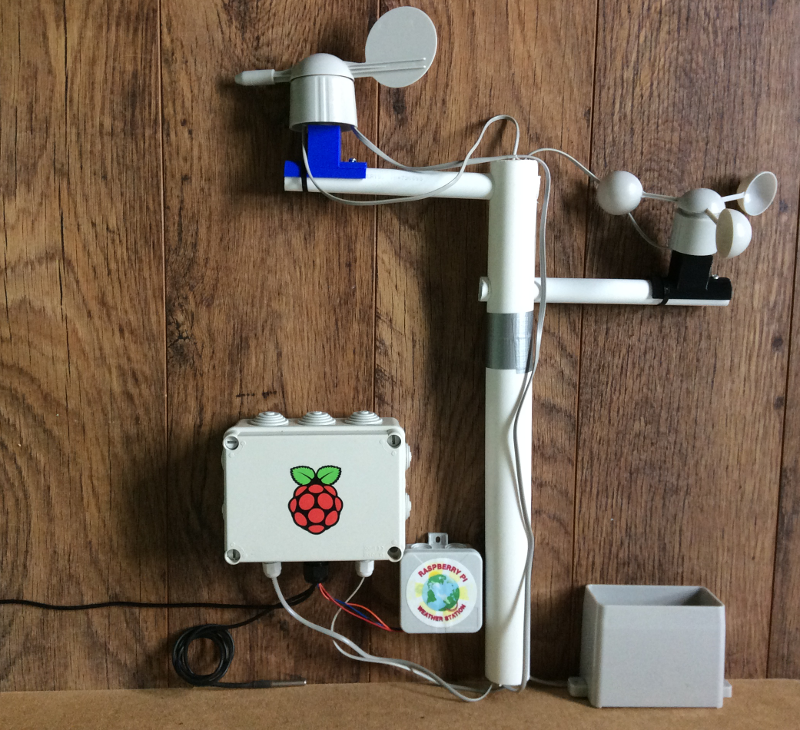

## Introduction

In 2016 we gave out nearly 1000 Oracle Raspberry Pi Weather Stations to schools from around the world who applied to receive these kits.

The original Weather Station kit is a HAT for the Raspberry Pi which allows it to collect weather data using a variety of sensors. It is designed to be used in schools to enable students to create their own weather station, and has a range of resources to support its use.

These kits have been very popular. If you're one of the many people who has been wanting to get hold of one, this guide will take you through the process of building your own.

This is an advanced project both in terms of electronics and programming. You are should read through the whole project before purchasing any components.

### What you will make

A Weather Station for collecting local climate and environmental data.

### What you will learn

This project covers elements from the following strands of the [Raspberry Pi Digital Making Curriculum](http://rpf.io/curriculum):

[Use manufacturing techniques and tools to create a completed product](https://curriculum.raspberrypi.org/manufacture/developer/)

[Process input data to monitor or react to the environment](https://curriculum.raspberrypi.org/physical-computing/developer/)

[Apply abstraction and decomposition to solve more complex problems](https://curriculum.raspberrypi.org/programming/developer/)

### Additional information for educators

If you need to print this project, please use the [printer-friendly version](https://projects.raspberrypi.org/en/projects/project-name/print){:target="_blank"}.

Use the link in the footer to access the GitHub repository for this project, which contains all resources (including an example finished project) in the 'en/resources' folder.
