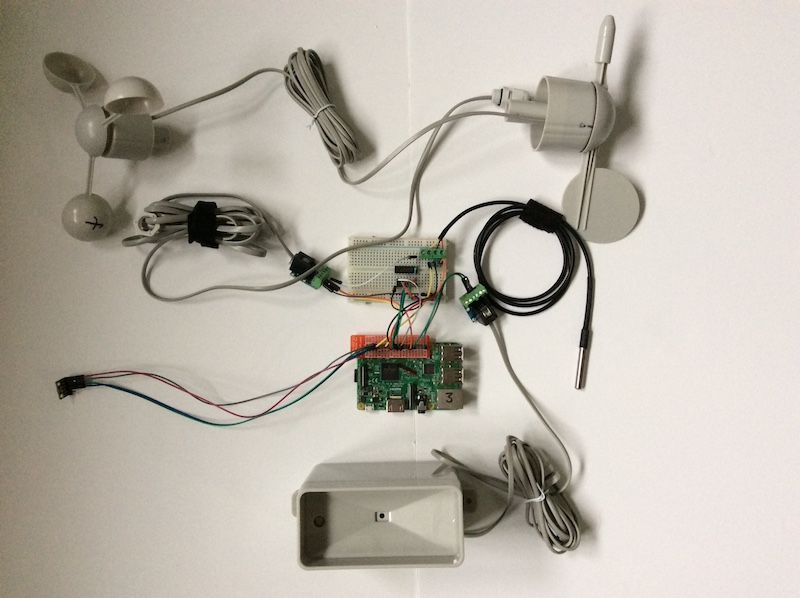
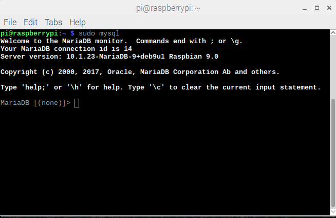
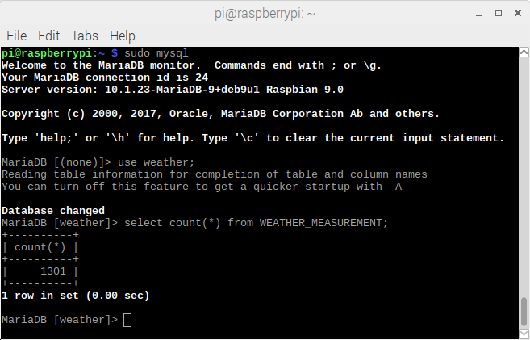

## Fully functional weather station

Now that you've tested all the sensors individually, it's time to set up the software so that you have a complete collection system.



The original Oracle Weather Station adopts a Unix daemon approach to running the software, and you can adapt that code to run your custom build. The GPIO connections you've been using so far match those expected by this software so a slightly modified version of the code will work, and you've already used the original Oracle Weather Station code for the DS18B20 digital thermal probe.

To complete your custom Weather Station, you can also adapt and amalgamate the code you've written for testing to to regularly measure and record

### Wind speed, gusts and direction

The code you wrote for wind speed and gust measurement will form the basis of your overall Weather Station software.

Take a copy of your `wind.py` and call it `weather_station_BYO.py` (you can can do this in Idle by opening `wind.py` and then using *Save As*).

- You will need to add some additional libraries, some of the Oracle Weather Station code along with some of the programs you've already written. the top of your file should contain the following:

```python
from gpiozero import Button
import time
import math
import bme280_sensor
import wind_direction_byo
import statistics
import ds18b20_therm

```
As it currently stands, your code will continually record the wind speed every 5 seconds, keeping track of the largest measurement (gusts) and calculating the mean speed. You can extend this to also simultaneously measure wind direction.

- Modify your code so that instead of pausing for 5 seconds in each loop, the program takes 5 seconds worth of wind direction measurements.

---hints---
---hint---
You can use the same time.time() method to create a second sub-loop inside the first. Make sure you use a different variable name to store the starting time.
---/hint---
---hint---
You can also use a list to store the wind direction readings just as you did for the wind speeds.
```python
store_directions = []
```
---/hint---
---hint---
Your modified function could look like this. You can use the `get_average` function you wrote to calculate this value from the list of measurements.

```python
while True:
    start_time = time.time()
    while time.time() - start_time <= wind_interval:
        wind_start_time = time.time()
        reset_wind()
        #time.sleep(wind_interval)
        while time.time() - wind_start_time <= wind_interval:
                store_directions.append(wind_direction_byo2.get_value())

        final_speed = calculate_speed(wind_interval)
        store_speeds.append(final_speed)
    wind_average = wind_direction_byo2.get_average(store_directions)

    wind_gust = max(store_speeds)
    wind_speed = statistics.mean(store_speeds)
    print(wind_speed, wind_gust, wind_average)
```
---/hint---
---/hints---

- Test your code. Spin the anemometer and wind vane. Does the program produce sensible values.

- Currently your program is constantly updating the mean values and peak wind speed as new measurements are made. Your Weather Station should start afresh with each 5 seconds of measurement. Add two lines to your code to empty the lists that hold the wind speeds and directions after every pass through the loop.

---hints---
---hint---
You need to empty the `store_speeds` and `store_directions` lists.
---/hint---
---hint---
You can do this with the lines:
```python
store_speeds = []
store_directions =[]
```
---/hint---
---hint---
Your modified function could look like this.

```python
while True:
    start_time = time.time()
    while time.time() - start_time <= wind_interval:
        wind_start_time = time.time()
        reset_wind()
        #time.sleep(wind_interval)
        while time.time() - wind_start_time <= wind_interval:
                store_directions.append(wind_direction_byo2.get_value())

        final_speed = calculate_speed(wind_interval)
        store_speeds.append(final_speed)
    wind_average = wind_direction_byo2.get_average(store_directions)

    wind_gust = max(store_speeds)
    wind_speed = statistics.mean(store_speeds)
    print(wind_speed, wind_gust, wind_average)
    store_speeds = []
    store_directions =[]
```
---/hint---
---/hints---

- Test your code again. You should see that you are recording the angular position of the wind vane, and counting the rotations of the anemometer for 5 seconds. Your code then calculates the mean wind speed and average position of the vane for that period. You will have also noticed that the value for wind gust is now always the same as the mean, because you are emptying the list of speeds after every 5 second period - so there is only ever 1 value (the last one).

Every 5 seconds is a nice sampling speed, but is too frequent to be storing new measurements.  A better period of measurement would be every 5 *minutes*. You can then store 5 minutes worth of of speeds and then record the peak value (gust) from that collection of measurements. That is much more useful!

- Modify the code so that it calculates new mean speeds and directions and records the strongest gust every 5 minutes, with a sampling frequency of 5 seconds.

---hints---
---hint---
You should change the period of the outer-most timed loop to be 5 minutes.
---/hint---
---hint---
Create another variable called `interval` outside the main (`while True`) loop:
```python
interval = 300
```
5 x 60 seconds = 300
---/hint---
---hint---
Then use that as the timing comparison for the outer timed loop:

```python
while True:
    start_time = time.time()
    while time.time() - start_time <= interval:
        wind_start_time = time.time()
        reset_wind()
        #time.sleep(wind_interval)
        while time.time() - wind_start_time <= wind_interval:
                store_directions.append(wind_direction_byo2.get_value())

        final_speed = calculate_speed(wind_interval)
        store_speeds.append(final_speed)
    wind_average = wind_direction_byo2.get_average(store_directions)

    wind_gust = max(store_speeds)
    wind_speed = statistics.mean(store_speeds)
    print(wind_speed, wind_gust, wind_average)
    store_speeds = []
    store_directions =[]
```
---/hint---
---/hints---
- Test your code. It should now report readings every 5 minutes. Simulate some wind activity by rotating the vane and anemometer and check that your measurements are what you'd expect.

Now you can add the other sensors into this 5 minute loop.

## Rainfall

Now you integrate the code your wrote for measuring rainfall  from `rainfall.py` into `weather_station_BYO.py` so that rainfall is measured for every 5 minutes and then the count reset.

- Add the bucket size constant definition to the list of other similar variables after the import lines.

```python
BUCKET_SIZE = 0.2794
```

- Add these lines before the `while True:` loop.

```python

def bucket_tipped():
    global rain_count
    rain_count = rain_count + 1
    #print (rain_count * BUCKET_SIZE)

def reset_rainfall():
    global rain_count
    rain_count = 0

rain_sensor = Button(6)
rain_sensor.when_pressed = bucket_tipped
```    

Then, after the lines which calculate the wind gusts and speed, add this code:

```python
rainfall = rain_count * BUCKET_SIZE
reset_rainfall()
```

## Temperature, Pressure and humidity

When you wrote the code for the BME280 pressure, temperature and humidity sensor, you created a `read_all` function to return all three measurements. You can call this function from within `weather_station_BYO.py` as you've included your `bme280_sensor` program as an imported library.

- Modify your code so that the readings from the BME280 are also recorded every 5 minutes.

---hints---
---hint---
You can call the `read_all` function that you wrote earlier.
---/hint---
---hint---
```python
humidity, pressure, ambient_temp = bme280_sensor.read_all()
```
---/hint---
---hint---
Your completed loop code  for making measurements should look like this:

```python
while True:
    start_time = time.time()
    while time.time() - start_time <= interval:
        wind_start_time = time.time()
        reset_wind()
        #time.sleep(wind_interval)
        while time.time() - wind_start_time <= wind_interval:
                store_directions.append(wind_direction_byo2.get_value())

        final_speed = calculate_speed(wind_interval)
        store_speeds.append(final_speed)
    wind_average = wind_direction_byo2.get_average(store_directions)
    wind_gust = max(store_speeds)
    wind_speed = statistics.mean(store_speeds)
    rainfall = rain_count * BUCKET_SIZE
    reset_rainfall()
    humidity, pressure, ambient_temp = bme280_sensor.read_all()
    print(wind_speed, wind_gust, rainfall, wind_average, humidity, pressure, ambient_temp)
    store_speeds = []
    store_directions =[]
```
---/hint---
---/hints---

- Test your code. Exhale onto the BME280 and check that the readings change appropriately.

- Now do the same thing for the ground temperature probe. Modify your code so that readings are collected every 5 minutes.

---hints---
---hint---
You will need to initialise the sensor first:

```python
temp_probe = ds18b20_therm.DS18B20()
```
---/hint---

---hint---
You can use the `read_temp()` function.
---/hint---

---hint---
Your completed code should look  like this:

```python
from gpiozero import Button
import time
import math
import bme280_sensor
import wind_direction_byo2
import statistics
import ds18b20_therm
import database

wind_count = 0       # Counts how many half-rotations
radius_cm = 9.0 # Radius of your anemometer
wind_interval = 5 # How often (secs) to sample speed
interval =  5 # measurements recorded every 5 minutes
CM_IN_A_KM = 100000.0
SECS_IN_AN_HOUR = 3600
ADJUSTMENT = 1.18
BUCKET_SIZE = 0.2794
rain_count = 0
gust = 0
store_speeds = []
store_directions = []


# Every half-rotation, add 1 to count
def spin():
	global wind_count
	wind_count = wind_count + 1
	#print( wind_count )

def calculate_speed(time_sec):
        global wind_count
        global gust
        circumference_cm = (2 * math.pi) * radius_cm
        rotations = wind_count / 2.0

        # Calculate distance travelled by a cup in km
        dist_km = (circumference_cm * rotations) / CM_IN_A_KM

        # Speed = distance / time
        km_per_sec = dist_km / time_sec
        km_per_hour = km_per_sec * SECS_IN_AN_HOUR

        # Calculate speed
        final_speed = km_per_hour * ADJUSTMENT

        return final_speed

def bucket_tipped():
    global rain_count
    rain_count = rain_count + 1
    #print (rain_count * BUCKET_SIZE)

def reset_rainfall():
    global rain_count
    rain_count = 0

def reset_wind():
    global wind_count
    wind_count = 0

def reset_gust():
    global gust
    gust = 0

wind_speed_sensor = Button(5)
wind_speed_sensor.when_activated = spin
temp_probe = ds18b20_therm.DS18B20()

while True:
    start_time = time.time()
    while time.time() - start_time <= interval:
        wind_start_time = time.time()
        reset_wind()
        #time.sleep(wind_interval)
        while time.time() - wind_start_time <= wind_interval:
                store_directions.append(wind_direction_byo2.get_value())

        final_speed = calculate_speed(wind_interval)# Add this speed to the list
        store_speeds.append(final_speed)
    wind_average = wind_direction_byo2.get_average(store_directions)
    wind_gust = max(store_speeds)
    wind_speed = statistics.mean(store_speeds)
    rainfall = rain_count * BUCKET_SIZE
    reset_rainfall()
    store_speeds = []
    #print(store_directions)
    store_directions = []
    ground_temp = temp_probe.read_temp()
    humidity, pressure, ambient_temp = bme280_sensor.read_all()

    print(wind_average, wind_speed, wind_gust, rainfall,  humidity, pressure, ambient_temp, ground_temp)


```
---/hint---
---/hints---

## Storing measurements in a database

One of the best ways to store your Weather data is in a database. Databases can store very large numbers of records efficiently and make it easier to sort, search and analyse your measurements.

There are many different choices of database software but MariaDb is a good, versatile general-purpose product. You should have already installed it - if not, head back to "What you will need" and follow the instructions there.

Now to configure the database.

- The database server will already be running. To connect to it, open a Terminal Window and type:

```bash
sudo mysql
```

You should then see that the command line prompt changes to be `MariaDB [(none)]>`. You should type the configuration commands at this prompt.



- First create a user and a password. You can choose whatever username you want, but make sure it has a strong password and that you remember the password you set.

```SQL
create user pi IDENTIFIED by 'my54cr4t';
```
The command above will create a user named `pi` with the password `my54cr4t`.  

- Assign all permission to this user.
```SQL
grant all privileges on *.* to 'pi' with grant option;
```

Remember to change `pi` to whatever username you created in the previous step.

- You can have more than one database on a server. You're going to create one called `weather` to hold your data:

```SQL
create database weather;
```

- Your database should have a table called WEATHER_MEASUREMENT which will hold all of your records. First, select the weather database as the place where this table will be stored:

```SQL
use weather;
```
You should now see the prompt change to be `MariaDB [weather]>`.

- Create the WEATHER_MEASUREMENT table with fields to hold your weather data.

```SQL
CREATE TABLE WEATHER_MEASUREMENT(
ID BIGINT NOT NULL AUTO_INCREMENT,
REMOTE_ID BIGINT,
AMBIENT_TEMPERATURE DECIMAL(6,2) NOT NULL,
GROUND_TEMPERATURE DECIMAL(6,2) NOT NULL,
AIR_QUALITY DECIMAL(6,2) NOT NULL,
AIR_PRESSURE DECIMAL(6,2) NOT NULL,
HUMIDITY DECIMAL(6,2) NOT NULL,
WIND_DIRECTION DECIMAL(6,2) NULL,
WIND_SPEED DECIMAL(6,2) NOT NULL,
WIND_GUST_SPEED DECIMAL(6,2) NOT NULL,
RAINFALL DECIMAL (6,2) NOT NULL,
CREATED TIMESTAMP NOT NULL DEFAULT CURRENT_TIMESTAMP,
PRIMARY KEY ( ID )
);
```
Now you can modify your `weather_station_BYO.py` program to record data in the database. Once again you can use code from the Oracle Raspberry Pi Weather Station software.

- Add this line to the top of `weather_station_BYO.py`:

```python
import database
```
- Just before the main `while True` loop, add this line to connect your code to the MariaDB database:

```python
db = database.weather_database()
```
- Then finally, under the line in the main `while True` loop that prints your data readings, add this line to insert a row of records into the database:

```python
db.insert(ambient_temp, ground_temp, 0, pressure, humidity, wind_average, wind_speed, wind_gust, rainfall)
```

- Save your code. Now using nano or another text editor, modify the `/home/pi/weather-station/credentials.mysql` file so that it contains the username and password you created for your MariaDB database.

 ```json
 {
"HOST": "localhost",
"USERNAME": "pi",
"PASSWORD": "my54cr4t",
"DATABASE": "weather"
}
 ```

## Test your weather_station_BYO.py.

You may see warning messages about truncated values, but these can be safely ignored.

- Run the code for a while to allow it to record several values (you can always adjust the value of the variable `interval` to a smaller number if you're impatient and don't want to wait 5 minutes in between each iteration).

- Check that no errors are produced (except for the warnings about truncated values).

- Open a Terminal Window and connect the the MariaDB database:

```bash
sudo mysql
```
- Select the *weather* database:

```SQL
 use weather;
 ```

 - Then run this SQL query which will tell you how many rows are in the WEATHER_MEASUREMENT table:

 ```SQL
 select count(*) from WEATHER_MEASUREMENT;
 ```

This should display a number which matches the number of times your code has made a weather data measurement.


