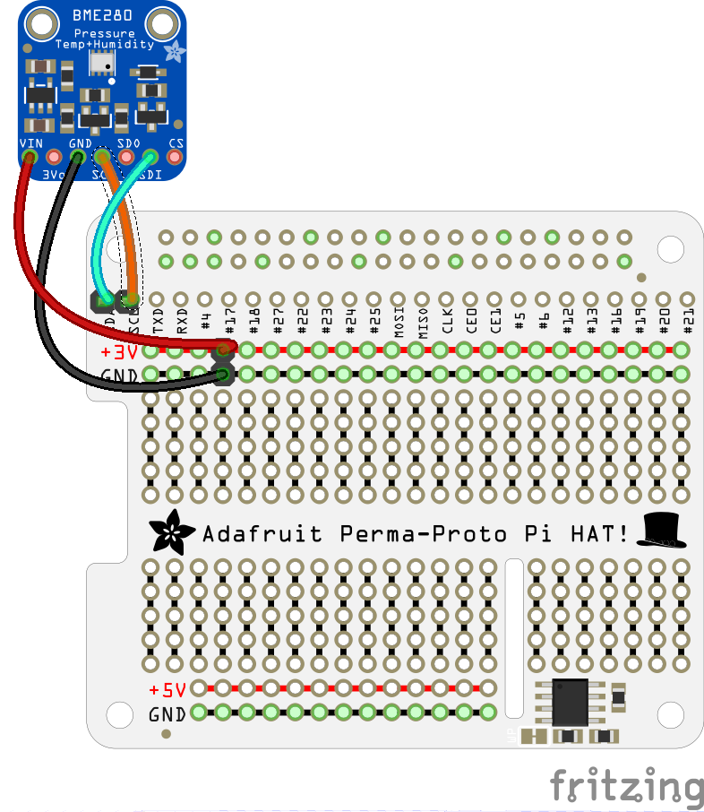
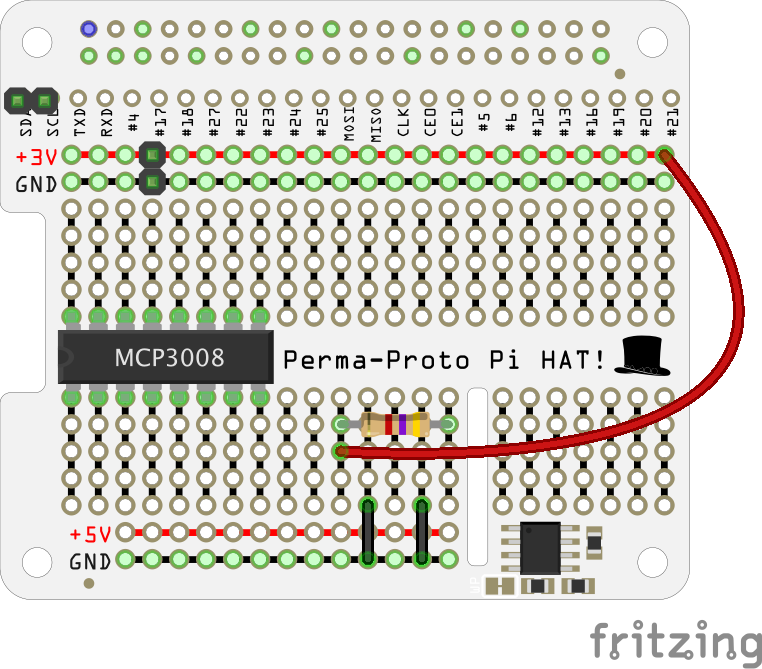
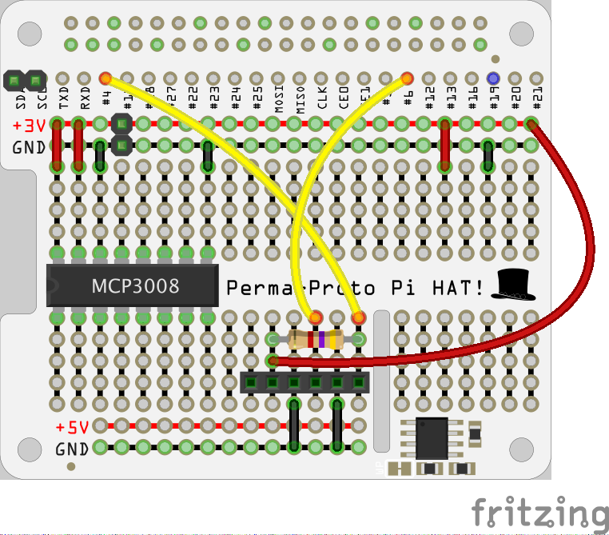
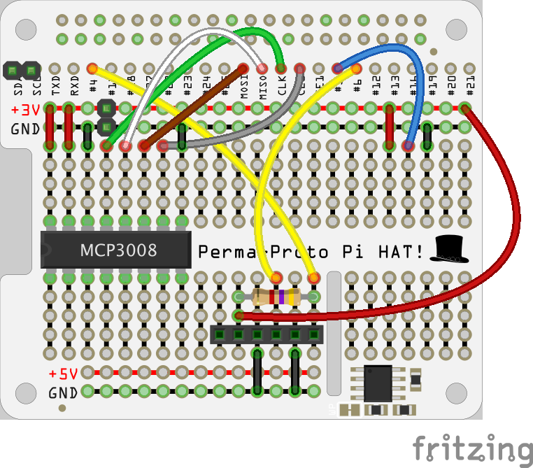

## Assembling everything for outdoors

### Wireless connectivity

So that your weather station can upload data to somewhere you can view and analyse it, it will need some form of internet connection. Using WiFi is typically the easiest way to do this, but you can use the ethernet connection if that works better for your location. There's a guide about setting up wireless connectivity on your Raspberry Pi [here](https://www.raspberrypi.org/documentation/configuration/wireless/), and some special hints for getting wireless access working with a weather station are [here](https://www.raspberrypi.org/learning/weather-station-guide/outside2.md).

### Make a weather station HAT

You should now have a working weather station prototype on a breadboard. If you are happy keeping your weather station in this form, then scroll down to the *Keeping your weather station dry* section.

For a more robust, long-term installation, or if you don't have room for a breadboard in your enclosure, you can construct a weather station HAT (hardware attached on top) for your Pi. This will involve some soldering, and if you've never soldered before, we have a [great resource plus video tutorial](https://projects.raspberrypi.org/en/projects/getting-started-with-soldering) to get you started.

If you are going to solder your project using the recommended components, make sure to read through all the instructions before starting. The assembly is a little tricky, and it will taken even an experienced maker two to four hours.

As usual, there is more than one way to do this this. You could design a layout for stripboard (also known as veroboard).

Soldering stripboard connections can be trickier than the 'through-hole' type you may be familiar with from assembling other digital making kits. However, prototyping HATs for Raspberry Pi are also available and these have plated through hole (PTH) connections that are much easier tow work with.

The circuit diagram below shows a possible design for a weather station HAT using the Adafruit Perma-Proto HAT Kit. You can lay things out differently if you have used alternative components.

#### Things to note about this circuit diagram

- To avoid cluttering the view, the six pins for each of the two RJ11 breakout boards are shown as female headers.

- Interpreting this diagram requires a slightly different approach to building a breadboard circuit. Because the PTH connections go all the way through the board, you can actually (and usefully) route and connect wires and components on either side.

In the photo above, you can see that two 2-pin male connectors have been used for the BME280 sensor. This method makes assembly easier, because the sensor should be housed in a separate enclosure. However, you could solder the wires connecting the sensor directly to the HAT (after threading them through the water-tight glands or grommets used).

## Assembly

You are recommended to assemble and test things one step at a time, checking each connection to a weather sensor once you've added it to the board.

- First of all, solder the 40-pin header onto the Adafruit board.

- Solder on two 2-pin male headers, one across the SCL and SDA connections in the top left-hand corner, and one across the **3V** and **GND** rails.

- Connect the BME280 sensor to these pins and place the HAT on the Pi.

- Boot the Pi and test that the BME280 sensor works using the `bme280_sensor.py` code that you wrote earlier.

Next, add connections for the DS18B20 probe. On the breadboard you used screw terminals. You could use them again on the proto-board, but you may have noticed that one of the RJ11 breakout boards has some unused pins. You can be sneaky and make use of the unused screw terminals to save space: the rainfall gauge only uses the two centre pins of the connector, so the two outer ones on either side are free.

- Power down the Pi and remove the HAT.

- Solder a 4.7K ohms resistor in the bottom area as shown. Your RJ11 breakout board will need to sit just above this, so try to seat the resistor so that it is flat against the top of the Adafruit board and not poking upwards.

- Now add two connections to the bottom **GND** rail using small lengths of wire.

- Then add longer wires to connect the GPIO pin breakout connections (**GPIO 4, 6**) and the **3V** rail. Once again, try to keep these as low as possible where the RJ11 breakout board will sit. As mentioned earlier, you can solder the wires through from the bottom of the HAT rather than across the top. As long as the correct holes are connected together, it doesn't matter which side of the HAT you use.

The connection to the **3V** rail will pass through a 'busy' part of the board if it goes over the top, so this is a good choice to put it on the rear.

- Now prepare the RJ11 breakout board. Some of the pre-soldered parts of these breakout boards can be quite spiky. To avoid these peaks of solder from causing shorts when placed onto the Adafruit board, carefully trim them with side cutters. It is also a good idea to then cover them with a small strip of insulating tape.

- With some versions of the smaller boards, the male pins you need for connection to the Adafruit board are supplied separately. You may have to solder them onto the breakout board first. Make sure the shortest end of the pin is the part that you solder on, as the longer end is the part that you'll solder onto the Adafruit board.

- Solder the RJ11 breakout board in place, making sure that the pins slot into the correct place on the Adafruit board. Be careful not to melt the plastic on the RJ11 socket. The pins from the breakout board are quite long and will make contact with the HDMI port on the Raspberry Pi when the HAT is in place. Therefore, you should either trim them or use some insulating tape on the top of the HDMI port to prevent a short circuit.

- Connect the DS18B20 sensor to the screw terminals on the breakout board as shown below.

- Carefully remount the HAT on the Pi. Before powering up the Pi, check that none of the soldered connections on the bottom of the Adafruit board are touching the top components on the Pi. If they are, trim the wires or pins in question.   

- Power up the Pi and test your DS18B20 sensor using the `ds18b20_therm.py` script.

- Connect the rain gauge's RJ11 connector to your HAT.

- Test that the rain gauge works using the `rainfall.py` scripts you've written.

Now you need to add the MCP3008 ADC. While you can solder the IC directly onto the Adafruit board, it is much better to use a DIP/DIL IC socket. This reduces the chance of damage to the IC and also makes it easier to swap components out in future.

- Remove the HAT and solder the socket onto the Adafruit board, in the position shown by the MCP3008 IC in the diagram.

- Now use five short strips of wire to make connections to the **3V** and **GND** rails for the IC and the second RJ11 breakout board.

- Using some longer wire strips, add in the other connections to the GPIO pins. You can use either the front or the back of the board to route these connections, although soldering the GPIO ends near the black plastic of the female header on the back can be trickier than on top.

- Add two final wires for the wind vane part of the circuit.

- Then solder on the second 4.7K ohms resistor.

- The final step is to add the second RJ11 breakout board, remembering to ensure that no short circuits are caused by spiky or long pins protruding from the bottom of the board.

- Carefully insert the MP3008 IC into the socket. You may need to gently bend the legs slightly so that they fit in without being crushed under the main body of the chip itself.

- Remount the HAT on the Pi again. Check that none of the soldered connections on the bottom of the Adafruit board are touching the top components on the Pi. Trim any wires or pins if they are.

- Plug in the RJ11 connector from the wind sensors and test them using the `wind_direction_byo.py` and `wind.py` scripts you wrote.

- You should now have a fully working weather HAT. Test it for a while with the full program that you completed in the previous step.

## Keeping your weather station dry

This is really important. If the Pi or any of the electronics gets wet or even very damp, they will fail or start to corrode. The Oracle Raspberry Pi Weather Station uses a small weatherproof enclosure to house the external environmental sensors. The key idea is to allow outside air to flow around the sensors but to prevent moisture from reaching them.

- Find two waterproof enclosures, one larger one for the Pi and the breadboard or HAT, and another smaller one for the BME280 sensor. The larger box should have a couple of holes for the RJ11 cables connecting the wind and rain sensors, and for some long wires to the BME280.

- Most commercial enclosures will have holes for routing cables, some with grommets that help keep out moisture. Alternatively, you can cut or drill your own holes and use grommets and sealing glands around the cables.

- If you're using the recommended enclosures as listed in the _What you will need_ section, then you can use these 3D-printable mounts to secure the Raspberry Pi inside the larger box and the BME280 sensor into the smaller one. The BME280 bracket should just slot in.

- Use short self-tapping screws to secure the mounts into the holes and/or grooves at the back of the larger box.

- In oder to get representative readings for ambient temperature and humidity, air needs to circulate around the BME280 sensor. Remove both hole covers from one side of the smaller box. You can then pass the wires for the sensor up through one hole. Make sure you mount this box outside with the holes are facing downwards so that rain cannot enter this way.

- Use waterproof nylon cable glands to prevent moisture entering the enclosure through the holes used for the cables. If the glands don't fit snugly around the cables, you could 3D print some grommets or wrap electrical tape around the cable to make a tighter seal.

- The larger recommended enclosure has holes on all four sides that are sealed with rubber plugs. Use three of these holes along the bottom of the box to provide an escape route for your cables. Use a M16 cable gland in each of the two outer holes and pass the cable for the rain gauge through one and the cable for the wind sensors through the other.

- If you're using the Ethernet cable to provide wired network access for your weather station, you may need to use a larger gland or an extra one of the holes in the enclosure.

- Then use the larger M20 gland for the centre hole and feed the power cable, DS18B20 probe, and the wires for the BME280 sensor through.

- The hole in the M20 is quite large, so you should pad the cables to ensure a tight fit (if you use a smaller gland, then the micro USB connector for the power cable would not be able to pass through). A 3D-printable grommet is available here — use two rotated at 180 degrees to each other so that there is no gap all the way through.

- The larger box can be installed inside, making it much easier to keep it dry, and allowing easier connection to power and networking. However, the various cables for the external sensors (rain gauge, wind vane, anemometer, and BME280) all need to be routed inside so this may involve a bigger hole in an external wall. Mounting everything outside means you only have to supply power to the weather station (assuming you are using wireless connectivity for data transfer).

Now you're ready to install your weather station outside. You could mount your station on a wall, rooftop, fence, or even on a plumbing pipe stuck in the ground. As long as the sensors are open to the elements, any location is fine. Don't forget:

- The rain gauge needs to collect rain
- The anemometer and wind vane need to be in the wind
- The smaller BME280 box needs to breathe — try to avoid situating it in direct sunlight
- The weather station needs to be connected to power, and to a network (wirelessly or via an Ethernet cable)

It is not possible to provide specific instructions for mounting your station, as the exact method will depend on your particular location and environment. However, here are some tips for a couple of aspects of the process that should help you get started:

+ [Installing your Weather Station outside: wind sensors](https://www.raspberrypi.org/learning/weather-station-guide/outside1.md)

+ [Installing your Weather Station outside: connecting to WiFi](https://www.raspberrypi.org/learning/weather-station-guide/outside2.md)

You may not be able to find an ideal location. Perhaps trees block the wind, or the rain gauge is partially sheltered by an overhang. Don't worry, just install your weather station anyway! You could even use this as a learning opportunity: for example, would it be possible to take reduced rain readings into account automatically? If airflow around the BME280 is limited, could you add in a small fan?

## Share your design

Now that you've built your own weather station, why not share your design and installation with the community? If you've used different sensors or chosen another circuit layout, please post the details on the [Weather Station forum](https://www.raspberrypi.org/forums/viewforum.php?f=112&sid=e893b51c323da761164dc232a929f962). We always love to see photos of weather station builds, and we might even feature them on our blog on in weather station newsletters.
