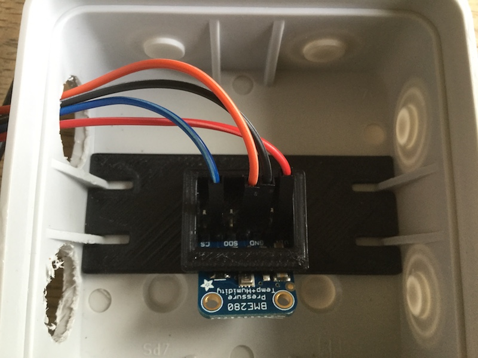
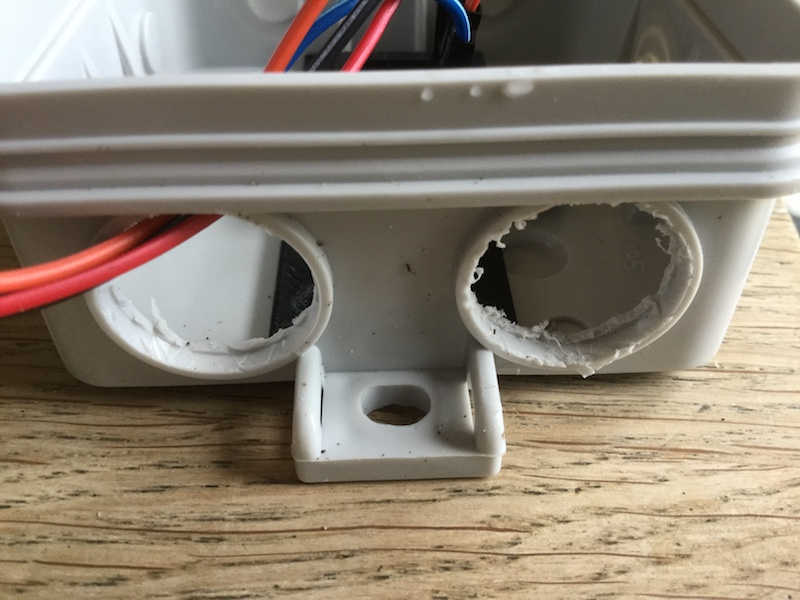

## Keeping your weather station dry

This is really important. If the Pi or any of the electronics gets wet or even very damp, they will fail or start to corrode. The Oracle Raspberry Pi Weather Station uses a small weatherproof enclosure to house the external environmental sensors. The key idea is to allow outside air to flow around the sensors but to prevent moisture from reaching them.

### Weatherproof boxes

- Find two waterproof enclosures, one larger one for the Pi and the breadboard or HAT, and another smaller one for the BME280 sensor. The larger box should have a couple of holes for the RJ11 cables connecting the wind and rain sensors, and for some long wires to the BME280.

- Most commercial enclosures will have holes for routing cables, some with grommets that help keep out moisture. Alternatively, you can cut or drill your own holes and use grommets and sealing glands around the cables.

- If you're using the recommended enclosures as listed in the _What you will need_ section, then you can use [this 3D-printable mount to secure the Raspberry Pi inside the larger box](resources/BYOWS-bracket.stl){:target="_blank"}. and [this one to hold BME280 sensor into the smaller one](resources/bme280holder.stl){:target="_blank"}.. The BME280 bracket should just slot in.

- Use short self-tapping screws to secure the mounts into the holes and/or grooves at the back of the larger box.

- In oder to get representative readings for ambient temperature and humidity, air needs to circulate around the BME280 sensor. Remove both hole covers from one side of the smaller box. You can then pass the wires for the sensor up through one hole. Make sure you mount this box outside with the holes are facing downwards so that rain cannot enter this way.

- Use waterproof nylon cable glands to prevent moisture entering the enclosure through the holes used for the cables. If the glands don't fit snugly around the cables, you could 3D print some grommets or wrap electrical tape around the cable to make a tighter seal.

- The larger recommended enclosure has holes on all four sides that are sealed with rubber plugs. Use three of these holes along the bottom of the box to provide an escape route for your cables. Use a M16 cable gland in each of the two outer holes and pass the cable for the rain gauge through one and the cable for the wind sensors through the other.

- If you're using the Ethernet cable to provide wired network access for your weather station, you may need to use a larger gland or an extra one of the holes in the enclosure.

- Then use the larger M20 gland for the centre hole and feed the power cable, DS18B20 probe, and the wires for the BME280 sensor through.

- The hole in the M20 is quite large, so you should pad the cables to ensure a tight fit (if you use a smaller gland, then the micro USB connector for the power cable would not be able to pass through). A 3D-printable grommet is available [here](resources/BYOWS-grom.stl){:target="_blank"}. — use two rotated at 180 degrees to each other so that there is no gap all the way through.

- The larger box can be installed inside, making it much easier to keep it dry, and allowing easier connection to power and networking. However, the various cables for the external sensors (rain gauge, wind vane, anemometer, and BME280) all need to be routed inside so this may involve a bigger hole in an external wall. Mounting everything outside means you only have to supply power to the weather station (assuming you are using wireless connectivity for data transfer).

Now you're ready to install your weather station outside. You could mount your station on a wall, rooftop, fence, or even on a plumbing pipe stuck in the ground. As long as the sensors are open to the elements, any location is fine. Don't forget:

- The rain gauge needs to collect rain
- The anemometer and wind vane need to be in the wind
- The smaller BME280 box needs to breathe — try to avoid situating it in direct sunlight
- The weather station needs to be connected to power, and to a network (wirelessly or via an Ethernet cable)

It is not possible to provide specific instructions for mounting your station, as the exact method will depend on your particular location and environment. However, here are some tips for a couple of aspects of the process that should help you get started:

+ [Installing your Weather Station outside: wind sensors](https://www.raspberrypi.org/learning/weather-station-guide/outside1.md)

+ [Installing your Weather Station outside: connecting to WiFi](https://www.raspberrypi.org/learning/weather-station-guide/outside2.md)

You may not be able to find an ideal location. Perhaps trees block the wind, or the rain gauge is partially sheltered by an overhang. Don't worry, just install your weather station anyway! You could even use this as a learning opportunity: for example, would it be possible to take reduced rain readings into account automatically? If airflow around the BME280 is limited, could you add in a small fan?

## Share your design

Now that you've built your own weather station, why not share your design and installation with the community? If you've used different sensors or chosen another circuit layout, please post the details on the [Weather Station forum](https://www.raspberrypi.org/forums/viewforum.php?f=112&sid=e893b51c323da761164dc232a929f962). We always love to see photos of weather station builds, and we might even feature them on our blog on in weather station newsletters.
