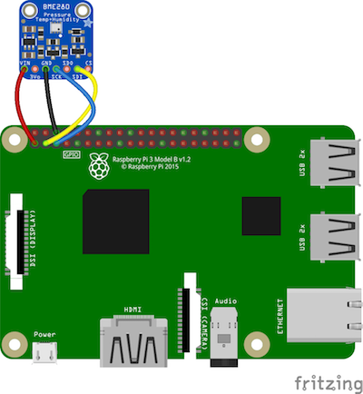
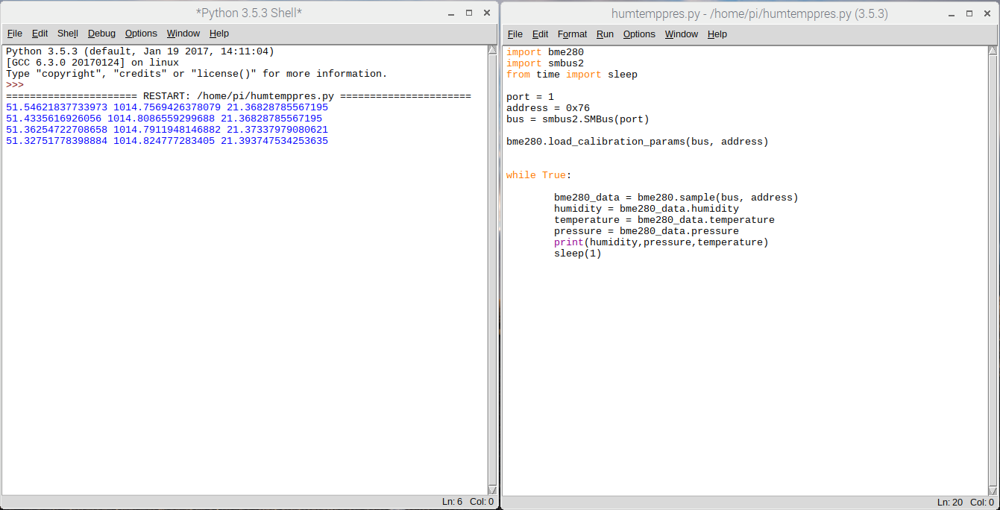
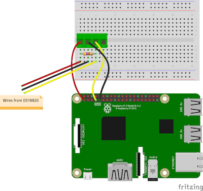
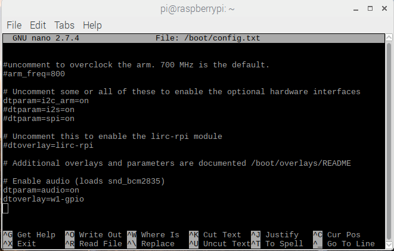
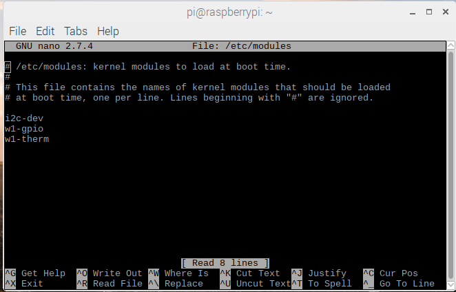
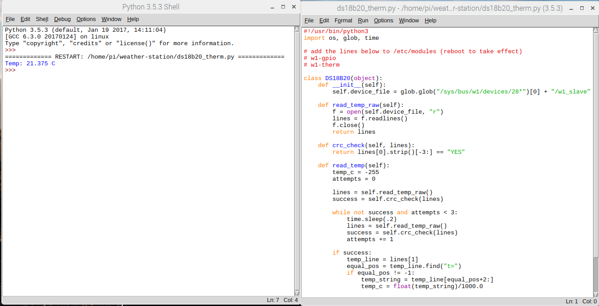
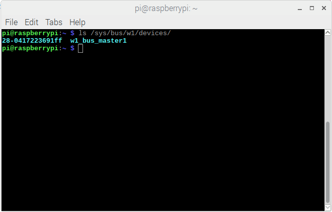

## Humidity, Temperature and pressure

The BME280 sensor is a digital sensor that can measure temperature, humidity and atmospheric pressure. It is available in a number of breakout boards from popular manufacturers such as Adafruit and Sparkfun. This guide assumes you have the Adafruit package, but the instructions should be applicable to most versions.

### Wiring up the sensor.



- Connect up the sensor to your Pi as shown in the diagram above.

| Pi GPIO  |BME280  |
|-------|----------|
| 17 (3v3) | Vin |
| 6 (Gnd) | Gnd|
| 3 (SDA) | SDA (SDI) |
| 5 (SCL) | SCL (SCK)|

Some breakout boards may have other pins (such as SDO or CSB) but these are not generally needed.


- Open Idle

[[[rpi-gui-idle-opening]]]

- Create a new Python file and save it as `/home/pi/weather-station/humtemp.py`

```python
import bme280
import smbus2
from time import sleep

port = 1
address = 0x76
bus = smbus2.SMBus(port)

bme280.load_calibration_params(bus,address)


while True:
    bme280_data = bme280.sample(bus,address)
    humidity  = bme280_data.humidity
    pressure  = bme280_data.pressure
    ambient_temperature = bme280_data.emperature
    print(humidity, pressure, temperature)
    sleep(1)
```
- Now test the code.

- While the code is running, exhale onto the sensor and you should see the values increase. When you've finished testing, terminate the code by typing cntrl+c in the Python shell.



The BME280 will report the air temperature, but this can be significantly warmer than the ground. A thermal probe stuck into the soil is a useful supplemental temperature measurement and can be useful to indicate the presence of ice in winter.  The Dallas DS18B20 temperature sensor comes in many forms including a waterproof thermal probe version and this is the sensor used on the Oracle Weather Station.

- Normally the DS18B20 comes with 3 bare wires so the easiest way to prototype and test the sensor is using PCB mount screw terminal blocks which can also be plugged into breadboards. Connect your DS18B20 as shown in the circuit diagram below.  



- Edit the file /boot/config:

```bash
sudo nano /boot/config.txt
```
 - Add the line below at the bottom of the file:

 ```bash
 dtoverlay=w1-gpio
 ```


- Then edit /etc/modules

```bash
sudo nano /etc/modules
```

- Add the lines below at the bottom of the file:

```bash
w1-gpio
w1-therm
```


- Reboot the Raspberry Pi

- Open the file /home/pi/weather-station/ds18b20_therm.py in Idle and run it. You should see the temperature printed out in the Python Shell window.  



- Put the probe into a glass of cold water and re-run the program. the new temperature reported should be lower (unless you were working in a very cold room in the first place).

### Troubleshooting

- If your are unable to take readings from the DS18B20, check that the wires from the probe are securely connected to the screw terminals and that you have modified the `/etc/modules` and `/boot/config.txt` correctly. If you open a Terminal window and type:

```bash
ls /sys/bus/w1/devices/
```
You should see two files listed. If these are not shown then recheck your wiring.


