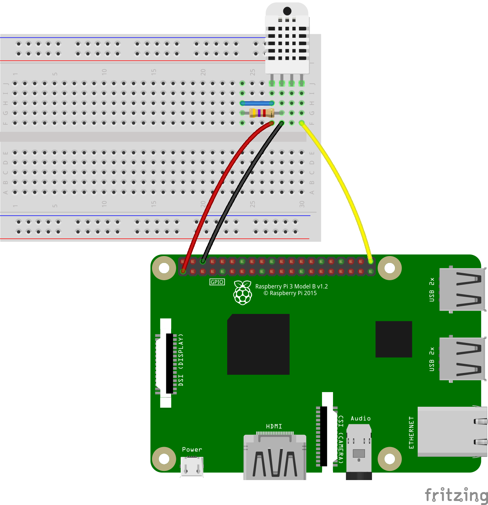
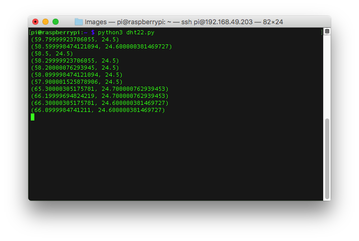

## Humidity and Temperature

The DHT22 and DHT11 sensors contain a capacitive humidity sensor and a thermistor in one physical package. The DHT22 is more accurate but slower at reporting readings than the DHT11 and therefore the recommended choice. However a DHT11 will work perfectly well as long as you modify your code as shown in the examples below.

### Wiring up the sensor.



- Connect up the sensor to your Pi as shown in the diagram above.
- Open Idle

[[[rpi-gui-idle-opening]]]

- Create a new Python file and save it as `/home/pi/dht22.py`
- Add the following lines. If you're using a DHT11, use the alternative line as shown in the code comments.

```python
import Adafruit_DHT
from time import sleep

DHT22_pin = 21
humidity_sensor = Adafruit_DHT.DHT22 # DHT22 sensor
# humidity_sensor = Adafruit_DHT.DHT11 # DHT11 sensor

def read_dht22(pin):
    humidity, ambient_temperature = Adafruit_DHT.read_retry(humidity_sensor,pin)
    while humidity is None or ambient_temperature is None:
        humidity, ambient_temperature = Adafruit_DHT.read_retry(humidity_sensor,pin)
        time.sleep(0.1)
    return humidity, ambient_temperature

while True:
    print(read_dht22(DHT22_pin))
    sleep(0.5)
```
- Now test the code by opening a terminal window and running:

```bash
python3 dht22.py
```

- While the code is running, exhale onto the sensor and you should see the values increase.


