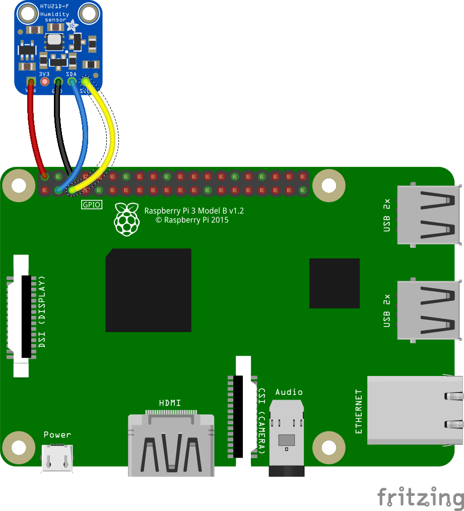
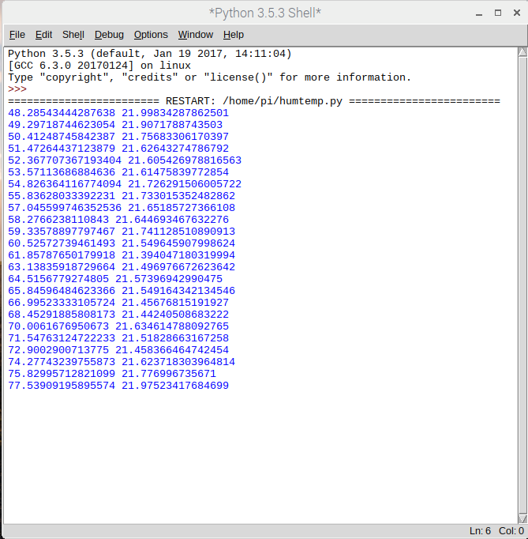

## Humidity and Temperature

The HTU21D-F sensor is a digital humidity sensor that can also measure temperature. The Adafruit breakout board also incorporates a PTFE membrane to protect the sensor ffrom dust and provides an i2c interface.

### Wiring up the sensor.



- Connect up the sensor to your Pi as shown in the diagram above.

| Pi GPIO  |HTU21D  |
|-------|----------|
| 2 (5v) | Vin |
| 6 (Gnd) | Gnd|
| 3 (SDA) | SDA |
| 5 (SCL) | SCL|

The 3v3 connection on the HTU21D-F is not used.


- Open Idle

[[[rpi-gui-idle-opening]]]

- Create a new Python file and save it as `/home/pi/weather-station/humtemp.py`

```python
import HTU21D
from time import sleep

htu21d_sensor = HTU21D.HTU21D()

while True:
    humidity  = htu21d_sensor.read_humidity()
    ambient_temperature = htu21d_sensor.read_temperature()
    print(humidity, temperature)
    sleep(0.5)
```
- Now test the code.

- While the code is running, exhale onto the sensor and you should see the values increase. When you've finished testing, terminate the code by typing cntrl+c in the Python shell.



The HTU21D-F will report the air temperature, but this can be significantly warmer than the ground. A thermal probe stuck into the soil is a useful supplemental temperature measurement and can be useful to indicate the presence of ice in winter.  The Dallas DS18B20 temperature sensor comes in many forms including a waterproof thermal probe version and this is the sensor used on the Oracle Weather Station.

- Normally the DS18B20 comes with 3 bare wires so the easiest way to prototype and test the sensor is using PCB mount screw terminal blocks which can also be plugged into breadboards. Connect your DS18B20 as shown in the circuit diagram below.  


- Edit the file /boot/config:

```bash
sudo nano /boot/config.txt
```
 - Add the line below at the bottom of the file:

 ```bash
 dtoverlay=w1-gpio
 ```


- Then edit /etc/modules

```bash
sudo nano /etc/modules
```

- Add the lines below at the bottom of the file:

```bash
w1-gpio
w1-therm
```


- Reboot the Raspberry Pi

- Open the file /home/pi/weather-station/ds18b20_therm.py in Idle and run it. You should see the temperature printed out in the Python Shell window.  


- Put the probe into a glass of cold water and re-run the program. the new temperature reported should be lower (unless you were working in a very cold room in the first place).

### Troubleshooting

- If your are unable to take readings from the DS18B20, check that the wires from the probe are securely connected to the screw terminals and that you have modified the `/etc/modules` and `/boot/config.txt` correctly. If you open a Terminal window and type:

```bash
ls /sys/bus/w1/devices/
```
You should see two files listed. If these are not shown then recheck your wiring.


