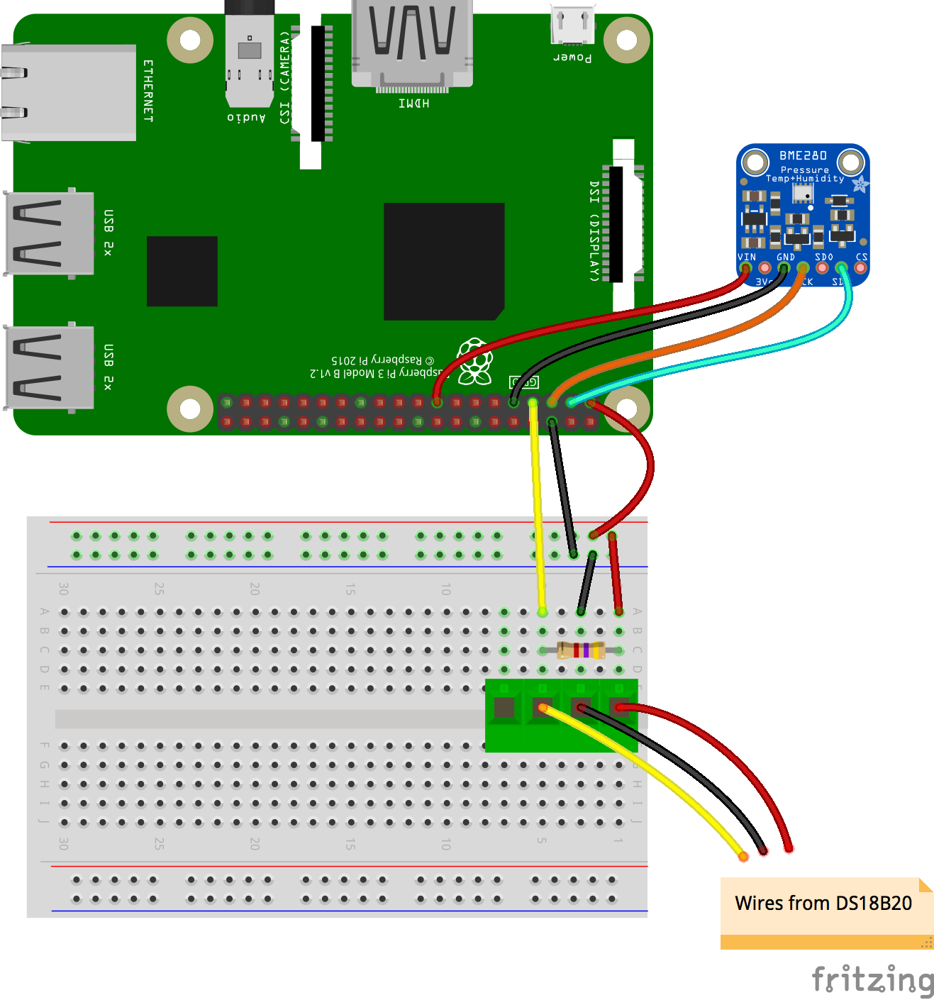

## Humidity, temperature and pressure

The BME280 sensor is a digital sensor that can measure temperature, humidity, and atmospheric pressure. It is available in a number of breakout boards from popular manufacturers such as Adafruit and SparkFun. This guide assumes you have the Adafruit package, but the instructions should be applicable to most versions. One thing to check is that the I2C address is correct: for the Adafruit models it is 0x77 (as shown in the code below), but other versions can have different addresses (0x76 is a common alternative).

### Wiring up the sensor


- Connect up the sensor to your Pi as shown in the diagram above.

| Pi GPIO | BME280  |
|-------|----------|
| 17 (3V3) | Vin |
| 6 (Gnd) | Gnd|
| 3 (SDA) | SDA (SDI) |
| 5 (SCL) | SCL (SCK)|

Some other breakout boards may have other pins (such as SDO or CSB), but those are not generally needed.

- Open IDLE.

[[[rpi-gui-idle-opening]]]

- Create a new Python file, save it as `/home/username/weather-station/bme280_sensor.py`. Replace `username` with your username on your Raspberry Pi, and add the following code to it:

```python
import bme280
import smbus2
from time import sleep

port = 1
address = 0x77 # Adafruit BME280 address. Other BME280s may be different
bus = smbus2.SMBus(port)

bme280.load_calibration_params(bus,address)

while True:
    bme280_data = bme280.sample(bus,address)
    humidity  = bme280_data.humidity
    pressure  = bme280_data.pressure
    ambient_temperature = bme280_data.temperature
    print(humidity, pressure, ambient_temperature)
    sleep(1)
```

- Now test the code: while the code is running, exhale onto the sensor. You should see the humidity values (and possibly the temperature values) increase. When you've finished testing, terminate the code by typing <kbd>ctrl+c</kbd> in the Python shell.

Once you're happy that the sensor is recording sensible values, you can go on to modify the program so that it is ready to be used as part of the whole weather station operation later.

- Replace the `while True` loop with a function called `read_all()` that returns the humidity, pressure, and temperature readings, in that order.

---hints---
---hint---
Functions are declared with the `def` keyword:

```python
def read_all():
```

---/hint---
---hint---
Add a line to sample the data from the I2C device. Then return the temperature, pressure, and humidity components of that reading.

---/hint---
---hint---
Your file should look like this:
```python
import bme280
import smbus2
from time import sleep

port = 1
address = 0x76
bus = smbus2.SMBus(port)

bme280_load_calibration_params(bus, address)

def read_all():
    bme280_data = bme.sample(bus,address)
    return bme280_data.humidity, bme280_data.pressure, bme280_data.temperature

```
---/hint---
---/hints---


## Ground temperature

The BME280 will report the air temperature, but this can be significantly warmer than the ground, particularly if it is frosty. A thermal probe stuck into the soil is a useful supplemental temperature measurement and can be used to indicate the presence of ice/frost in winter. The Dallas DS18B20 temperature sensor comes in many forms including a waterproof thermal probe version, and this is the sensor used on the Oracle Raspberry Pi Weather Station.

### Wiring up the sensor

- Normally the DS18B20 comes with three bare wires, so the easiest way to prototype and test the sensor is to use PCB mount screw terminal blocks that can also be plugged into breadboards. Add your DS18B20 to your circuit as shown in the diagram below. Note that you are setting up 3.3V and Ground rails along the side of the breadboard. These will be used later when you add extra sensors into the circuit.



- Open the file `/boot/config.txt`:

```bash
sudo nano /boot/config.txt
```
 - Edit it by adding the line below at the bottom:

 ```bash
 dtoverlay=w1-gpio
 ```


- Then open `/etc/modules`.

```bash
sudo nano /etc/modules
```

- Add the lines below at the bottom of the file:

```bash
w1-gpio
w1-therm
```


- Reboot the Raspberry Pi.

- Open the file `/home/pi/weather-station/ds18b20_therm.py` in IDLE and run it. You should see the temperature printed out in the Python shell window.  


- Put the probe into a glass of cold water and re-run the program. The new temperature reported should be lower (unless you were working in a very cold room in the first place!).

### Troubleshooting

- If you are unable to take readings from the DS18B20 sensor, check that the wires from the probe are securely connected to the screw terminals and that you have modified the `/etc/modules` and `/boot/config.txt` correctly.

+ Open a terminal window and type:

```bash
ls /sys/bus/w1/devices/
```
You should see two files listed. If these are not shown, then recheck your wiring.


