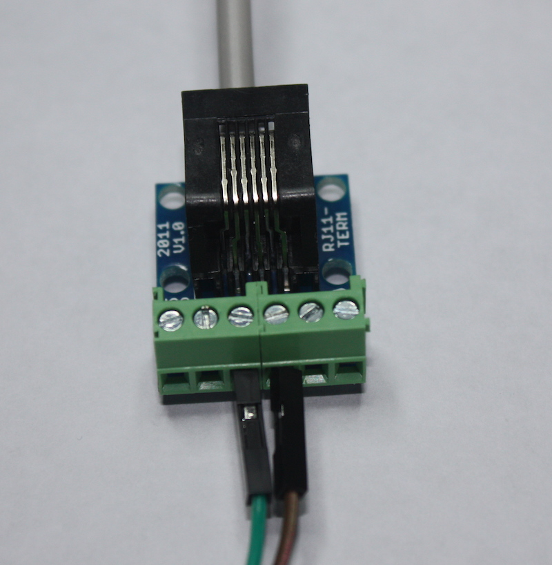

## Wind speed

A typical anemometer has three arms with scoops on the end that catch the wind and cause the arms to spin. If you were to dismantle one of the anemometers used by the original Oracle Weather Stations, you would find a small magnet attached to the underside.  


At two points within the magnet's rotation, it triggers a reed switch which produces a signal we can detect via a GPIO pin. So for each full rotation of the arms, the sensor will produce two detectable signals. By counting and timing these signals, you can calculate the speed of the wind.


There are many ways of doing this with Python. One approach is to treat the sensor like a button and then use the `gpiozero` library to count the number of times it has been 'pressed'.

- Consumer anemometers normally have two wires. Connect one to a **ground** pin and the other to **GPIO 5**. If you're using the RJ11 connectors, the anemometer uses the middle two wires of the cable, which are normally pins 3 and 4 on RJ11 breakout boards.



 With the anemometer added, your circuit should look like this:


- Open IDLE, create a new Python file, and save it as `/home/pi/weather-station/wind.py`.
- Add the lines below to use GPIOzero's `Button` functions and set up a Button on **GPIO 5**. Also create a variable called `wind_count` to store the number of rotations.

```python
from gpiozero import Button

wind_speed_sensor = Button(5)
wind_count = 0
```

- Now define a function that will be run whenever the pin is activated by a spin of the anemometer.

```python
def spin():
    global wind_count
    wind_count = wind_count + 1
    print("spin" + str(wind_count))

wind_speed_sensor.when_pressed = spin
```

- Save and run your code. Test it by manually turning the arms of the anemometer. In the Python shell, you should see your code being triggered and the count variable incrementing twice very rotation.


Now you can count the signals from the anemometer, you can use this data to calculate the wind speed.

### Calculating wind speed

The anemometer produces two signals per spin, so you can count the number of full rotations of the sensor by halving the number of detected inputs. This can then be used to calculate the wind speed:

**speed = distance / time**

To calculate **speed**, you need to know the **distance** travelled in a certain amount of **time**. Measuring time is fairly straightforward, and you can count the number of signals over the course of a fixed time period, for example five seconds.

The distance travelled by one of the cups will be equal to the number of rotations multiplied by the distance around the edge of the circle (circumference):

**speed = (rotations * circumference) / time**

The circumference can be calculated as long as you know either the **radius** or **diameter** of the circle.


You can discover the radius of the circle made by the anemometer by measuring the distance from the centre to the edge of one of the cups. Once you know the radius, you can find the circumference with the formula **2 * pi * radius**. Don't forget that a whole rotation generates two signals, so you'll need to halve the number of signals detected:

**speed = ( (signals/2) * (2 * pi * radius) ) / time**

The radius for the recommended anemometers used by the original Oracle Weather Station is 9.0cm, and that is the figure that will be used in the code examples that follow. Don't forget to change this value if your anemometer has different dimensions!

To implement this formula in Python, you can use the `math` library. For example, if you measured 17 signals from your anemometer in 5 seconds, your wind speed could be calculated like this:

```python
import math

radius_cm = 9.0
wind_interval = 5
wind_count = 17

circumference_cm = (2 * math.pi) * radius_cm
rotations = count / 2.0
dist_cm = circumference_cm * rotations
speed = dist_cm / wind_interval

print(speed)
```
- Remove (or comment out) the line in the `spin` function that prints out the `wind_count` value.

- Now use this formula to modify your `wind.py` code so that it also calculates the speed of the wind in centimetres per second (cm/s).

---hints---
---hint---
First, import the `math` and `time` libraries and set some variables to hold the radius of your anemometer and the time interval for measurements.

```python
import time
import math
radius_cm = 9.0 # Radius of your anemometer
wind_interval = 5    # How often (secs) to report speed
```

---/hint---
---hint---
Then create a new function to handle the calculation. This should take the time period of the measurement (in seconds) as an input and use the formula above to work out the speed.

```python
def calculate_speed(time_sec):
        global wind_count  
        circumference_cm = (2 * math.pi) * radius_cm        
        rotations = wind_count / 2.0
        dist_cm = circumference_cm * rotations
        speed = dist_cm / time_sec

        return speed
```

**Note**: you need to declare the `wind_count` variable as global so that it can be accessed from within the function.
---/hint---
---hint---
Finally, add a loop to continually take measurements every five seconds. The complete code might look something like this:

```python
from gpiozero import Button
import time
import math

wind_count = 0       # Counts how many half-rotations
radius_cm = 9.0 # Radius of your anemometer
wind_interval = 5    # How often (secs) to report speed

# Every half-rotation, add 1 to count
def spin():
	global wind_count
	wind_count = wind_count + 1
	# print("spin" + str(wind_count))

# Calculate the wind speed
def calculate_speed(time_sec):
        global wind_count  
        circumference_cm = (2 * math.pi) * radius_cm        
        rotations = wind_count / 2.0

        # Calculate distance travelled by a cup in cm
        dist_cm = circumference_cm * rotations

        speed = dist_cm / time_sec

        return speed


wind_speed_sensor = Button(5)
wind_speed_sensor.when_pressed = spin

# Loop to measure wind speed and report at 5-second intervals
while True:
        wind_count = 0
        time.sleep(wind_interval)
        print( calculate_speed(wind_interval), "cm/h")
```

---/hint---
---/hints---

### Measurement units

Currently, the code calculates the wind speed in cm/s. However, this is not particularly useful — a more practical unit would be kilometres per hour (km/h).

- Modify your code to return the wind speed in km/h.

---hints---
---hint---
In order to convert your units, you'll need to:

+ Convert cm to km by dividing the distance by the number of centimetres in 1 kilometre
+ Convert seconds to hours by multiplying the speed by the number of seconds in 1 hour
---/hint---
---hint---
It's a good idea to set up constants to store the values of the number of seconds in an hour and the number of centimetres in a kilometre. This will make your calculations less confusing for other people to understand.

```python
CM_IN_A_KM = 100000.0
SECS_IN_AN_HOUR = 3600
```
---/hint---
---hint---
Your new `calculate_speed` function should look like this:
```python
def calculate_speed(time_sec):
    global wind_count
    circumference_cm = (2 * math.pi) * radius_cm
    rotations = wind_count / 2.0

    dist_km = (circumference_cm * rotations) / CM_IN_A_KM

    km_per_sec = dist_km / time_sec
    km_per_hour = km_per_sec * SECS_IN_AN_HOUR

    return km_per_hour
```
---/hint---
---/hints---

### Calibration

Most anemometers will have a specification that includes calibration data to help you test the accuracy of your sensor. The [data sheet](https://www.argentdata.com/files/80422_datasheet.pdf){:target="_blank"} for the recommended anemometers says that one rotation a second should equate to 2.4 km/h. So in the example interval of five seconds, five spins (ten signals) should equal the same 2.4 km/h wind speed.

- Run your program and spin the anemometer five times within the first five seconds. What wind speed value is reported?


You'll probably find that the value doesn't match the specification. This loss of accuracy is due to something called the **anemometer factor**, and is a result of some of the wind energy being lost when the arms turn. To compensate for this, you can multiply the reading generated by your program by an adjustment factor.

For the recommended anemometers, this factor equals `1.18`.

-  Update the final line in your `calculate_speed` function to multiply your speed in km/h by `1.18`.

---hints---
---hint---
To make sure your code makes sense to other people, store the anemometer adjustment value as a constant with the value of `1.18`, and then use the constant in your wind speed calculation.

```python
ADJUSTMENT = 1.18
```
---/hint---
---hint---
Your new `calculate_speed` function should look like this:
```python
def calculate_speed(time_sec):
    global wind_count
    circumference_cm = (2 * math.pi) * radius_cm
    rotations = wind_count / 2.0

    dist_km = (circumference_cm * rotations) / CM_IN_A_KM

    km_per_sec = dist_km / time_sec
    km_per_hour = km_per_sec * SECS_IN_AN_HOUR

    return km_per_hour * ADJUSTMENT
```
---/hint---
---/hints---

- You'll need to alter the final `print` line of your code so that it now shows the output in the correct units.
- Re-run the code, and this time you should get a value closer to 2.4 km/h.

- When you assemble the complete weather station, it will be useful to be able to reset your `wind_count` variable to zero, so add a function that does that now:

```python
def reset_wind():
    global wind_count
    wind_count = 0
```
