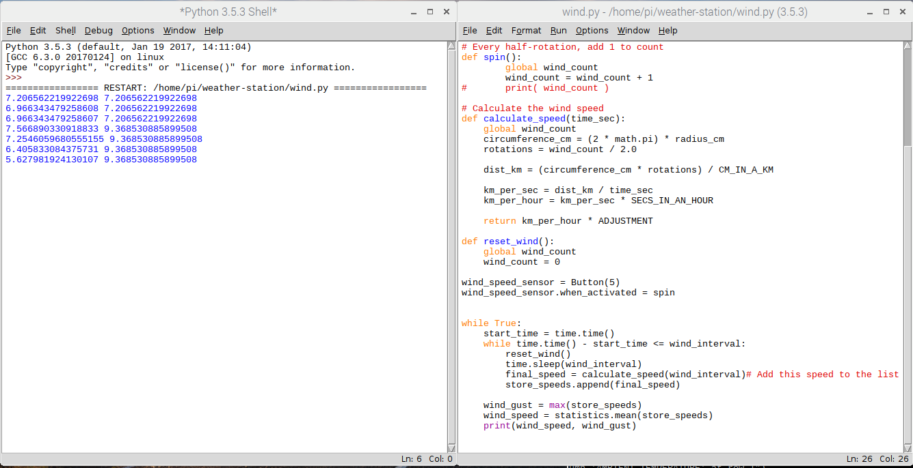

## Wind gusts

Weather reports and forecasts will normally report the wind speed along with wind gust information.

A wind gust is a brief increase in wind speed that can occur whenever the wind is blowing. Gusts are more noticeable as the wind speed increases. This is because the force exerted by the wind increases rapidly as the wind speed increases.  Gusts normally occur because the air is not able to move along the ground at a constant speed. Obstacles such as  from vegetation, buildings and elevation changes causes surface friction  which will slow the wind down in some places more than others. Air closer to the ground is suffers from this phenomenon more b than air which is higher up. This creates a more turbulent wind flow along the ground which leads to gusts. A typical wind gust lasts less than 20 seconds.

### Storing wind readings

When your Weather Station is fully operational, you can record the maximum wind speed during a given period (the gust) as well as the average speed. You can do this by constantly taking wind speed measurements for 5 seconds, and temporarily storing them for processing every few minutes. To do this we will use a Python data structure called a list.

- Open Idle and the open file your `/home/pi/wind.py` file that you created in the last step.

- Add a line at the very top to import the *statistics* library.

```python
import statistics
```

- Then add this line, which creates an empty list, after the `import` lines at the top.

```python
store_speeds = []
```

- Now modify the `while True` loop so that it contains a sub-loop that continually takes wind speed readings, and adds them to this list.

```python
while True:
    wind_start_time = time.time()
    while time.time() - wind_start_time <= wind_interval:
        reset_wind()
        time.sleep(wind_interval)
        final_speed = calculate_speed(wind_interval)# Add this speed to the list
        store_speeds.append(final_speed)

    wind_gust = max(store_speeds)
    wind_speed = statistics.mean(store_speeds)
    print(wind_speed, wind_gust)

```

Notice that we're using `time.time()` to create a variable called `start_time` and then checking when the time has advanced by more than `wind_interval` seconds in the inner `while` loop.

- Run you code. Blow on the anemometer or spin it by hand and watch the readings that are produced.



If you stop spinning you should see that the second reading remains the same (as this is the peak gust that has been produced) while the average speed falls off with time.
