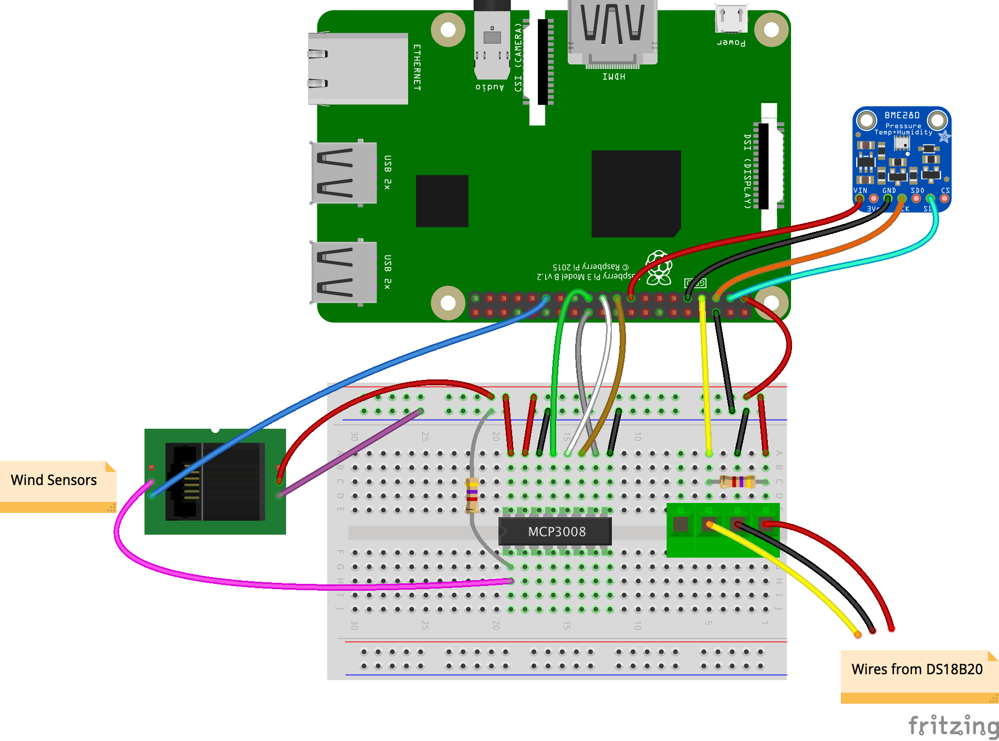

# Wind direction

### Wind vanes
Wind vanes show the direction the wind is coming from, not where it's going. This can be a little confusing in the beginning, because the arrows on most TV weather maps show the opposite. A wind vane works because wind exerts force on its vertical blade, which rotates to find the position of least wind resistance; this position is aligned with the direction of the oncoming wind.

### How your wind vane works
Like the rain gauge or anemometer, the wind vane used here also has reed switches and a rotating magnet, but it is more complex and works in a completely different way.

If you look inside the recommended wind vane, you'll see eight reed switches arranged like the spokes of a wheel.


There are also eight **resistors** in the wind vane, and as the magnet rotates, different reed switches will open and close and thus switch their corresponding resistor in and out of the circuit.

### The role of the resistors
Resistors are small components that resist/reduce the flow of electrical current without stopping it. Resistors can have different **resistance** values, reported in ohms Ω; those with low resistance let almost all current through, while those with high resistance let very little current through. The most common uses for resistors are protecting components from being damaged by currents that are too high, or dividing voltage between different parts of a circuit.

Each of the eight resistors has a different value, which you should see printed in white next to it (e.g. you can see 8.2K on the right). This allows the wind vane to have 16 possible combinations of resistance, since the magnet can close two neigboring reed switches when it's positioned halfway between them. You can find more information in the [data sheet](https://www.argentdata.com/files/80422_datasheet.pdf).

Most wind vanes you can connect to a Pi work in a similar way, so if you have a different model, consult its data sheet to find the values for the resistors.

### Measuring the resistance
In order to read the wind direction from the vane, you'll need to be able to measure the resistance produced by the sensor and convert that into an angle value. There are several steps in this process.

Instead of measuring the resistance value directly, it is actually much easier to record a **voltage** from the wind vane that varies according to which combination of resistors is currently switched into the circuit. This means you'll be measuring an **analogue** value: the wind vane will continuously report a **range** of voltages. By contrast, the anemometer simply reports a 'HIGH' or 'LOW' voltage — all or nothing, meaning it sends a **digital** signal.

[[[generic-theory-analogue-digital]]]

### Measuring analogue voltages with a Raspberry Pi

Unlike an Arduino, which has analogue inputs, the Raspberry Pi only has digital inputs. So to be able to interpret an analogue signal, you need a special component called an analogue-to-digital convertor (ADC).

A popular and versatile ADC is the MCP3008. It is a 16-pin integrated circuit (IC) with eight analogue inputs and can easily be used with a breadboard. It is a 10-bit ADC, meaning it has 2^10 = 1024 possible output values: e.g. for a reference voltage of 5V, the smallest change in voltage that the MCP3008 can detect is 5V/1024 = 4.88mV.

Now you can measure a changing analog signal using the MCP3008, you can use another clever circuit to produce a voltage that varies with the resistance of the wind vane.

### Using a voltage divider

Voltage dividers are among the most fundamental circuits in electronics, and they're used to reduce a large voltage into a smaller one.  


In the circuit above, the output voltage `Vout` can be calculated using the formula:

**`Vout = Vin * R2/R1 + R2`**

So by varying the values of `R1` and `R2`, you can reduce the input voltage `Vin` down to the output voltage `Vout`.

- Use this formula to create a new Python program called `voltage-divider.py` that contains a function `voltage_divider` that calculates `Vout` for a given set of `R1`, `R2`, and `Vin`.

---hints---
---hint---
To start off, create a function definition that takes the three input values:

```python
def voltage_divider(r1, r2, vin):
```
---/hint---
---hint---

Then add the formula.

```python
vout = (vin* r1)/(r1+r2)

```
---/hint---
---hint---

Finally, include a `return` statement. To make things easier to read, round the answer to three decimal places.
```python
def voltage_divider(r1,r2,vin):
    vout = (vin* r1)/(r1+r2)
    return round(vout,3)
```
---/hint---
---/hints---

- Test your function to make sure it provides the right answer for a selection of input values. For example, when `R1 = 33K ohms, R2 = 10K ohms` and a reference voltage of `Vin = 5V`, the function should return an answer of `3.837V`.

```python
print(voltage_divider(33000,10000,5.0))
```

Now returning to the circuit, if you imagine that `R2` is actually the resistance of some kind of variable resistor (a light-dependent resistor, for example), then by measuring `Vout`, we can calculate `R2` as long as we know `R1`. The wind vane acts like a variable resistor, so you can use a voltage divider circuit to measure its resistance value at any given time.

First of all, you need to find the best value for `R1` to use.

### Designing a voltage divider

You may have noticed that the second page of the wind vane data sheet contains a voltage divider circuit diagram and a table that lists angle, resistance, and voltage. The value quoted for `R1` in this diagram is 10K ohms. However, this circuit uses a `Vin` reference voltage of 5V. The logic levels on a Raspberry Pi are 3.3V, so these `Vout` figures are not quite right for what you need.

- Using the list of resistances from the datasheet and the voltage divider formula, write a small Python program called `vane_values.py` to calculate the new values for a 3.3V `Vin` with a `R1` resistance of 10K ohms.


---hints---
---hint---
To start off, create a list that contains all the resistances of the vane:

```python
resistances = [33000, 6570, 8200, 891,
               1000, 688, 2200, 1410,
               3900, 3140, 16000, 14120,
               120000, 42120, 64900, 21880]
```
Then loop through this list, calculating the output voltage for each value. You can use the `voltage_divider` function you wrote earlier for this part.  
---/hint---
---hint---

To loop through the list and print out each value, you could use the code:

```python

for x in range(len(resistances)):
    print(resistance[x])
```
This can be expanded to include the calculation too.
---/hint---
---hint---

A complete solution, including rounding the values to three decimal places, is:
```python
resistances = [33000, 6570, 8200, 891,
               1000, 688, 2200, 1410,
               3900, 3140, 16000, 14120,
               120000, 42120, 64900, 21880]

def voltage_divider(r1,r2,vin):
    vout = (vin* r1)/(r1+r2)
    return round(vout,3)

for x in range(len(resistances)):
    print(resistances[x],voltage_divider(10000,resistances[x],3.3))
```
---/hint---
---/hints---

Using the value of `R1 = 10K ohms` works well when the reference voltage is 5V, but you should see that some of the possible voltages are quite close together when using 3.3V. By using a smaller value for R1, you can optimise the separation between the different voltages that correspond to the resistance values produced by the vane.

- Use your `vane_values.py` code to test alternative values for `R1`. Remember that only certain standard resistance values are available.

The most common in the range you'll need are (in K ohms):
+ 1
+ 1.2
+ 1.5
+ 1.8
+ 2.2
+ 2.7
+ 3.3
+ 4.7
+ 5.6
+ 6.8
+ 8.2

You should find that 4.7K ohms is a good value for the recommended wind vane.

- Now you know the value for `R1` in the voltage divider circuit, you can wire everything up to your ADC and the Pi.



Reading values from an MCP3008 ADC is very easy, thanks to the `pgiozero` library.

```Python
from gpiozero import MCP3008
import time
adc = MCP3008(channel=0)

print(adc.value)
```
This code will read channel 0 of the ADC and print its value scaled to between 0 and 1. To find the actual analog voltage that's recorded, multiply the value by the reference voltage supplied to the ADC.

- You need to test that your circuit is able to discriminate between the various angular positions of the wind vane. Create a small python program called `/home/pi/weather-station/wind_direction_byo.py` to count the different values produced by your circuit when the vane is rotated.  

---hints---
---hint---
Use the `gpiozero` library to create a MCP3008 instance:

```Python
from gpiozero import MCP3008
import time
adc = MCP3008(channel=0)
```

---/hint---
---hint---

Then create a list to hold all the values:

```python
values = []
```
Then add a loop to repeatedly read voltages from the ADC and add the read values to the list **if they aren't already present in it**.
---/hint---
---hint---

A complete solution is:
```Python
from gpiozero import MCP3008
import time
adc = MCP3008(channel=0)
count = 0
values = []
while True:
    wind =round(adc.value*3.3,1)
    if not wind in values:
        values.append(wind)
        count+=1
        print(count)
```
---/hint---
---/hints---

- Run your code while rotating the wind vane. Your should see the number of unique voltages seen so far printed out in the Python shell.


- You may also see some red text warning you about 'SPISoftwareFallback'. You can safely ignore this, but if you'd rather not have the warning appear again in future, click on the Raspberry Pi menu icon and select **Preferences > Raspberry Pi Configuration**. Then enable **SPI** in the Interfaces tab, and reboot your Pi.


- If everything is accurate to a very high level of precision, then you should be able to measure no more than 16 unique voltages. However because the ADC may record a rising or falling voltage, you may be able to generate a few more values through slow jiggling of the vane.  


- Modify your code to include a list of the possible correct values and check each reading from the ADC against this list. Have your code print a helpful message for each reading that indicates whether it was one of the correct values or not.

---hints---
---hint---
Add a list of possible values, all rounded to one decimal place. You can use your `voltage_divider` code to produce this list.

```Python
volts = [0.4, 1.4, 1.2, 2.8,
         2.9, 2.2, 2.5, 1.8,
         2.0, 0.7, 0.8, 0.1,
         0.3, 0.2, 0.6, 2.7]
```

---/hint---
---hint---

Then use an `if...else` conditional statement to test if the value from the ADC is in the `volts` list.
---/hint---
---hint---

A complete solution is:
```Python
from gpiozero import MCP3008
import time
adc = MCP3008(channel=0)
count = 0
volts = [0.4, 1.4, 1.2, 2.8,
         2.9, 2.2, 2.5, 1.8,
         2.0, 0.7, 0.8, 0.1,
         0.3, 0.2, 0.6, 2.7]
while True:
    wind =round(adc.value*3.3,1)
    if not wind in volts:
        print('Unknown value: ' + str(wind))
    else:
        print('Match: ' + str(wind))
```
---/hint---
---/hints---

The final step is to convert the readings from the vane into angles. At the heart of this is relationship between angle, resistance, and voltage. For every voltage value measured by the ADC, there is a corresponding resistance configuration of the wind vane, which in turn corresponds to the angle the vane's blade is at.

You can calculate the relationship between resistance and voltage using the `voltage_divider` function you wrote earlier. You can then look up the corresponding angle from the data sheet. So for example, if the ADC measures aa voltage of 0.4V, this corresponds to a resistance of 3.3K ohms, which maps to an angle of 0 (or 360) degrees.

- Modify your `wind_direction_byo.py` file and change your list of voltages into a Python **dictionary**: the voltages will be the **keys** and the corresponding angles will be the **values**.

[[[generic-python-key-value-pairs]]]

- Then change your `print` statements so that they display the angle of the vane.

---hints---
---hint---
Use the `voltage_divider` function to print the voltages and their corresponding resistance values. Then use the data sheet to look up the angles that map to those resistances.

---/hint---
---hint---
Your dictionary should look like this:
```python
volts = {0.4: 0.0,
         1.4: 22.5,
         1.2: 45.0,
         2.8: 67.5,
         2.7: 90.0,
         2.9: 112.5,
         2.2: 135.0,
         2.5: 157.5,
         1.8: 180.0,
         2.0: 202.5,
         0.7: 225.0,
         0.8: 247.5,
         0.1: 270.0,
         0.3: 292.5,
         0.2: 315.0,
         0.6: 337.5}
```
---/hint---
---hint---

A complete solution is:
```Python
from gpiozero import MCP3008
import time
adc = MCP3008(channel=0)
count = 0
values = []
volts = {0.4: 0.0,
         1.4: 22.5,
         1.2: 45.0,
         2.8: 67.5,
         2.7: 90.0,
         2.9: 112.5,
         2.2: 135.0,
         2.5: 157.5,
         1.8: 180.0,
         2.0: 202.5,
         0.7: 225.0,
         0.8: 247.5,
         0.1: 270.0,
         0.3: 292.5,
         0.2: 315.0,
         0.6: 337.5}
while True:
    wind =round(adc.value*3.3,1)
    if not wind in volts:
        print('unknown value ' + str(wind) + ' ' + str(volts[wind]))
    else:
        print('found ' + str(wind) + ' ' + str(volts[wind]))
```
---/hint---
---/hints---

You now have a Python program that reads the angle of the wind vane!

+ Test it by setting the wind vane into a certain position and checking that the code displays the correct value. Repeat for different positions.  

There is one last improvement you can make to the accuracy of your results, and that is to take multiple readings over a short period of time and then calculate the average value. The maths behind this is more complicated that you might think — you can read about it in detail [here](http://en.wikipedia.org/wiki/Directional_statistics){:target="_blank"}.

- Add the function below to your `wind_direction_byo.py` code.

```python
def get_average(angles):
    sin_sum = 0.0
    cos_sum = 0.0

    for angle in angles:
        r = math.radians(angle)
        sin_sum += math.sin(r)
        cos_sum += math.cos(r)

    flen = float(len(angles))
    s = sin_sum / flen
    c = cos_sum / flen
    arc = math.degrees(math.atan(s / c))
    average = 0.0

    if s > 0 and c > 0:
        average = arc
    elif c < 0:
        average = arc + 180
    elif s < 0 and c > 0:
        average = arc + 360

    return 0.0 if average == 360 else average
```
- To use it, you'll also need to import the `math` library by adding this line to the top of your file.

```python
import math
```

- Now, using a similar technique to how you checked for wind gusts in the previous step, modify your program so that in has a function `get_value()` that returns the average value for a given time period. This will make it easy to call this function from within your complete weather station code. 

---hints---
---hint---

Store a number of wind direction values in a list, then use the `get_average()` function to calculate the average.

---/hint---
---hint---

You can use the `time.time()` function to accurately record values for a given time period.
---/hint---
---hint---

A complete solution is:

```Python
def get_value(length=5):
    data = []
    print("Measuring wind direction for %d seconds..." % length)
    start_time = time.time()

    while time.time() - start_time <= length:
        wind =round(adc.value*3.3,1)
        if not wind in volts: # keep only good measurements
            print('unknown value ' + str(wind))
        else:
            data.append(volts[wind])

    return get_average(data)
```
---/hint---
---/hints---
