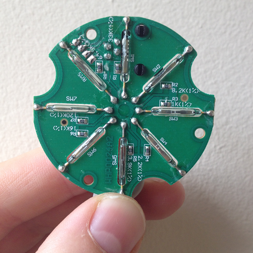
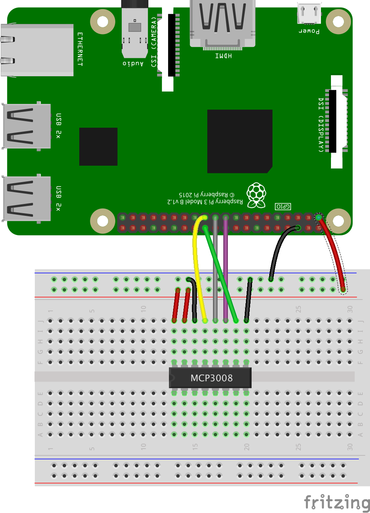
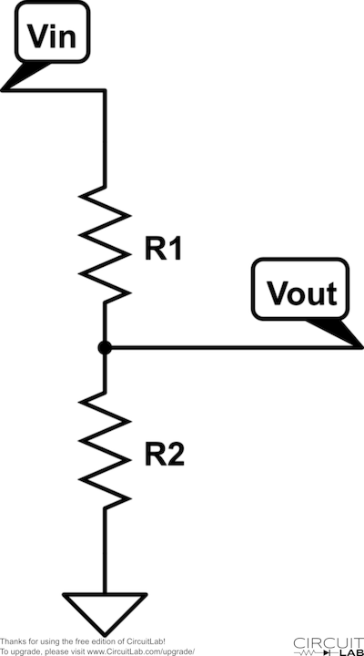
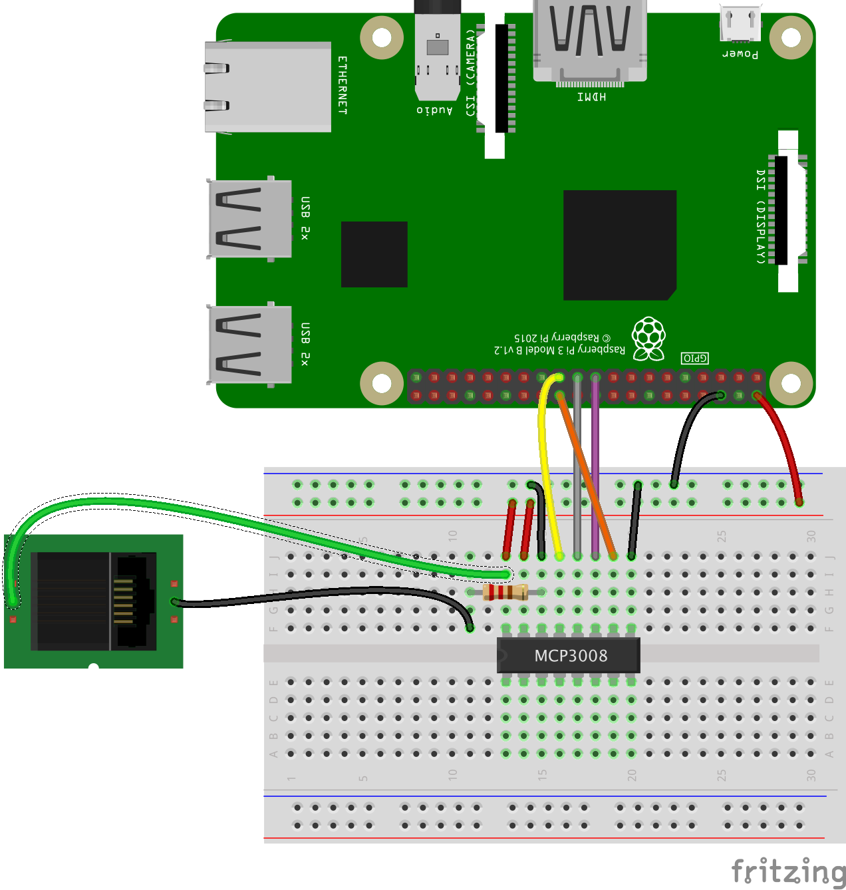
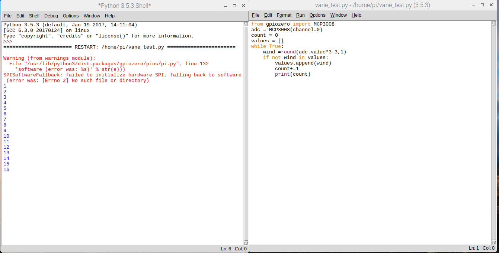
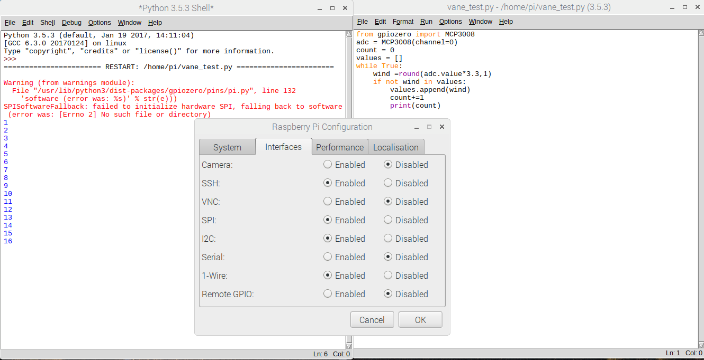
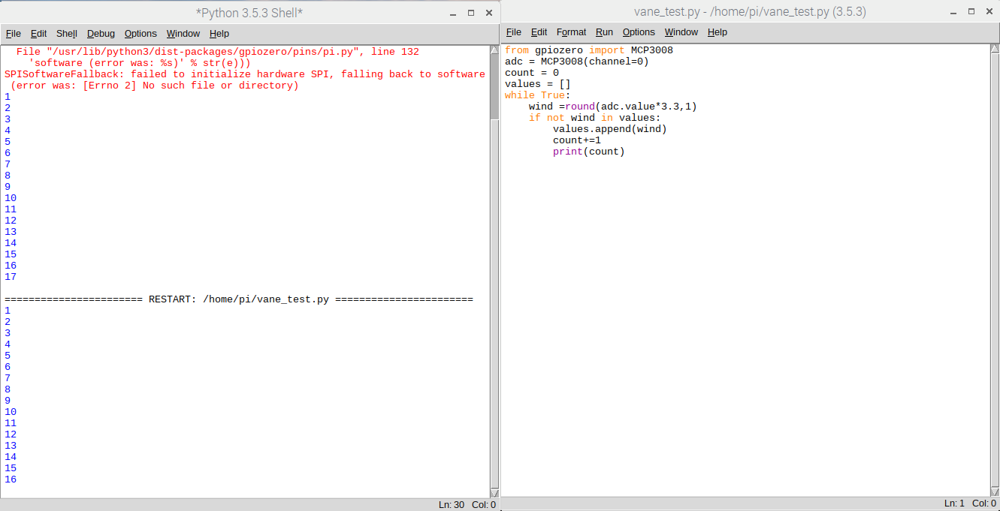

# Wind direction

A wind vane shows the direction from which the wind is coming, not where it's going; this can be confusing because the arrows on TV weather maps show the opposite. It works by the wind exerting force on a vertical blade which rotates to find the position of least resistance; this position is then aligned with the direction of the oncoming wind.

The wind vane is more complex than the rain gauge or anemometer. It does use reed switches and a rotating magnet, but it works in a completely different way.

If you look inside the recommended wind vane, you'll see there are eight reed switches arranged like the spokes of a wheel.



There are also eight resistors in the wind vane, and as the magnet rotates, different reed switches will open and close and thus switch their corresponding resistor in and out of the circuit.

Resistors are small components that resist/reduce the flow of electrical current but don't stop it.  Resistors can have different values; a low resistance value would let almost all current through, but a high resistance value would let very little through. The most common uses for resistors are to protect components from being damaged by too high a current, and to divide the voltage between different parts of a circuit.

Each of the eight resistors have different values which you should see printed in white text next to them (e.g. you can see 8.2K on the right). This allows the wind vane to have 16 possible combinations of resistance, since the magnet is able to close two reed switches when halfway between them. More information can be found in the [datasheet](https://www.argentdata.com/files/80422_datasheet.pdf).

Most wind vanes work in a similar way, so if you have a different model, consult its datasheet to find the values for the resistors.

In order to read the wind direction from the vane, you'll need to be able to measure the resistance produced by the sensor and convert that into an angle value. There are several steps in this process.

Instead of measuring the resistance value directly, it is actually much easier to record a voltage from the wind vane which varies according to which combination of resistors is currently being switched into the circuit. This is an *analogue* signal because it continuously reports a **range** of voltages. Compare this to the anemometer which simply reported a `HIGH` or `LOW` voltage, all or nothing, which is a *digital* signal.

[[[generic-theory-analogue-digital]]]

### Measuring analogue voltages with a Raspberry Pi

Unlike an Arduino which has analogue inputs, the Raspberry Pi only has digital inputs. So to be able to interpret an analogue signal, you need a special component called an Analogue to Digital Convertor (ADC).

A popular and versatile ADC is the MCP3008. It is a 16 pin Integrated Circuit (IC) that can easily be used with a breadboard and has 8 analogue inputs. It is a 10 bit ADC which means that is has 2^10 possible output values: so for a reference voltage of 5v, the smallest change in voltage that the MCP3008 can detect is 5/1024 = 4.88mV.

### Connecting the MCP3008



```Python
from gpiozero import MCP3008
adc = MCP3008(channel=0)
voltage = adc.value * 3.3
```
Now you can measure a changing analog signal using the MCP3008, we can use another clever circuit to produce a voltage that varies with the resistance of the wind vane.

### Using a voltage divider

Voltage dividers are one of the most fundamental circuits in electronics and are used to reduce a large voltage into a smaller one.  



In the circuit above, Vout can be calculated using the formula:

Vout = Vin * R2/R1 +R2

So by varying the values of R1 and R2, you can reduce the input voltage Vin down to the output voltage Vout.

-  Use this formula to create a new Python program called `voltage-divider.py` that contains a function *voltage_divider* that calculates Vout for a given set of R1,R2 and Vin.

---hints---
---hint---
To start off, create a function definition that takes the 3 input values:

```python
def voltage_divider(R1, R2, Vin):
```
---/hint---
---hint---

Then add the formula.

```python
vout = (vin* r1)/(r1+r2)

```
---/hint---
---hint---

Finally, include the return statement. To make things easier to read, round the answer to 3 decimal places.
```python
def voltage_divider(r1,r2,vin):
    vout = (vin* r1)/(r1+r2)
    return round(vout,3)
```
---/hint---
---/hints---

- Test your function to make sure it provides the right answer for a selection of input values. For example, when R1 = 33K, R2 = 10K and a reference voltage of 5v, the function should return an answer of 3.837v

Now returning to the circuit, if you imagine that R2 is actually some kind of variable resistor (a light dependent resistor for example), then by measuring Vout, we can calculate R2 as long as we know R1. The wind vane also acts like a variable resistor and so you can use a voltage divider circuit to measure its resistance value at any given time.

First of all, you need to find the best value for R1 to use.

### Designing a Voltage divider

You may have noticed that the second page of the wind vane datasheet contains a voltage divider circuit diagram and a table that lists angle, resistance and voltage. The value quoted for R1 in this diagram is 10K. However this circuit uses a Vin reference voltage of 5v.  The logic levels on a Raspberry Pi are 3.3v so these Vout figures are not quite right for what you need.

- Using the list of resistances from the datasheet  and the voltage divider formula, write a small Python program called `vane_values.py` to calculate the new values for a 3.3v Vin with a R1 resistor of 10K.


---hints---
---hint---
To start off, create a list that contains all the resistances:

```python
resistances = [33000, 6570, 8200, 891,
               1000, 688, 2200, 1410,
               3900, 3140, 16000, 14120,
               120000, 42120, 64900, 21880]
```
Then loop through this list, calculating the output voltage for each value. You can use the `voltage_divider` function you wrote earlier for this part.  
---/hint---
---hint---

To loop through the list, printing each value out you could use the code:

```python

for x in range(len(resistances)):
    print(resistance[x])
```
This can then be expanded to include the calculation too.
---/hint---
---hint---

A complete solution, including rounding the values to 3 decimal places is:
```python
resistances = [33000, 6570, 8200, 891,
               1000, 688, 2200, 1410,
               3900, 3140, 16000, 14120,
               120000, 42120, 64900, 21880]

def voltage_divider(r1,r2,vin):
    vout = (vin* r1)/(r1+r2)
    return round(vout,3)

for x in range(len(resistances)):
    print(resistances[x],voltage_divider(10000,resistances[x],3.3))
```
---/hint---
---/hints---

Using the value of R1 = 10K works well when the reference voltage is 5v, but you should see that some of the possible voltages are quite close together when using 3.3v. By using a smaller value for R1, you can optimise the separation between the different voltages that correspond to the resistance values produced by the vane.

- Use your `vane_values.py` code to test alternative values for R1. Remember that only certain standard resistance values are available. The most common in the range you'll need are: 1K, 1.2K, 1.5K, 1.8K, 2.2K. 2.7K, 3.3K, 4.7K, 5.6K, 6.8k, 8.2K.

You should find that 4.7K is a good value for the recommended wind vane.

- Now you know the value for R1 in the voltage divider circuit, you can wire everything up to your ADC and the Pi.



- You need to test that your circuit is able to discriminate between the various angular positions of the wind vane. Create a small python program called `vane_test.py` to count the different values produced by your circuit when the vane is rotated.  

---hints---
---hint---
Use the gpiozero library to create a MCP3008 instance:

```Python
from gpiozero import MCP3008
adc = MCP3008(channel=0)
```

---/hint---
---hint---

Then create a list to hold all the values:

```python
values = []
```
Then add a loop to repeatedly read voltage from the ADC and add the value to the list **if it isn't already present**.
---/hint---
---hint---

A complete solution is:
```Python
from gpiozero import MCP3008
adc = MCP3008(channel=0)
count = 0
values = []
while True:
    wind =round(adc.value*3.3,1)
    if not wind in values:
        values.append(wind)
        count+=1
        print(count)
```
---/hint---
---/hints---

- Run your code while rotating the wind vane.  Your should see the number of unique voltages seen so far printed out in the Python shell.



- You may also see some red text warning about 'SPISoftwareFallback'. You can safely ignore this, but if you'd rather it not not appear in future, click on the Raspberry menu button and select *Preferences -> Raspberry Pi Configuration*. Then enable *SPI* under the Interfaces tab, and reboot.



- If everything is accurate to a very high level of precision then the count should go no higher than 16. However because the ADC may record a rising or falling voltage, you may be able to generate a few more values through slow jiggling of the vane.  



- Modify your code to include a list of the possible correct values and check each reading from the ADC against this list. Have your code print a helpful message for each reading.

---hints---
---hint---
Add a list of possible values, all rounded to 1 decimal place. You can use your `voltage_divider` code to produce this list.

```Python
volts = [0.4, 1.4, 1.2, 2.8,
         2.9, 2.2, 2.5, 1.8,
         2.0, 0.7, 0.8, 0.1,
         0.3, 0.2, 0.6, 2.7]
```

---/hint---
---hint---

Then use an `if...else` conditional statement to test if the value from the ADC is in the `volts` list.
---/hint---
---hint---

A complete solution is:
```Python
from gpiozero import MCP3008
adc = MCP3008(channel=0)
count = 0
volts = [0.4, 1.4, 1.2, 2.8,
         2.9, 2.2, 2.5, 1.8,
         2.0, 0.7, 0.8, 0.1,
         0.3, 0.2, 0.6, 2.7]
while True:
    wind =round(adc.value*3.3,1)
    if not wind in volts:
        print('Unknown value: ' + str(wind))
    else:
        print('Match: ' + str(wind))
```
---/hint---
---/hints---

The final step is to convert the readings from the vane into angles. At the heart of this is relationship between angle, resistance and voltage. For every voltage value measured by the ADC, there is a corresponding resistance configuration of the wind vane, which in turn corresponds to the angle at which the vane is pointing.

You can calculate the relationship between resistance and voltage using the `voltage_divider` function you wrote earlier. You can then look up the corresponding angle from the datasheet. So for example, a voltage measured by the ADC of 0.4v corresponds to a resistance of 3.3K, which maps onto an angle of 0 (or 360) degrees.

- Modify your `vane_test.py` and change your list of voltages into a Python dictionary: the voltages will be the keys and the corresponding angles will be the values.

[[[generic-python-key-value-pairs]]]

- Then change your print functions so that they display the angle of the vane.

---hints---
---hint---
Use the `voltage_divider` function to print the voltages and their corresponding resistance values. Then use the datasheet to look up the angles that map onto those resistances.

---/hint---
---hint---
Your dictionary should look like this:
```python
volts = {0.4: 3300,
         1.4:6570,
         1.2:8200,
         2.8:891,
         2.7:1000,
         2.9:688,
         2.2:2200,
         2.5: 1410,
         1.8: 3900,
         2.0: 3140,
         0.7: 16000,
         0.8: 14120,
         0.1: 120000,
         0.3: 42120,
         0.2: 64900,
         0.6: 21880}
```
---/hint---
---hint---

A complete solution is:
```Python
from gpiozero import MCP3008
adc = MCP3008(channel=0)
count = 0
values = []
volts = {0.4: 3300,
         1.4: 6570,
         1.2: 8200,
         2.8: 891,
         2.7: 1000,
         2.9: 688,
         2.2: 2200,
         2.5: 1410,
         1.8: 3900,
         2.0: 3140,
         0.7: 16000,
         0.8: 14120,
         0.1: 120000,
         0.3: 42120,
         0.2: 64900,
         0.6: 21880}
while True:
    wind =round(adc.value*3.3,1)
    if not wind in volts:
        print('unknown value ' + str(wind) + ' ' + str(volts[wind]))
    else:
        print('found ' + str(wind) + ' ' + str(volts[wind]))
```
---/hint---
---/hints---

You now have a Python program that reads the angle of the wind vane. Test it by setting the wind vane into a certain position and checking that the code displays the correct value. repeat for different positions.  
