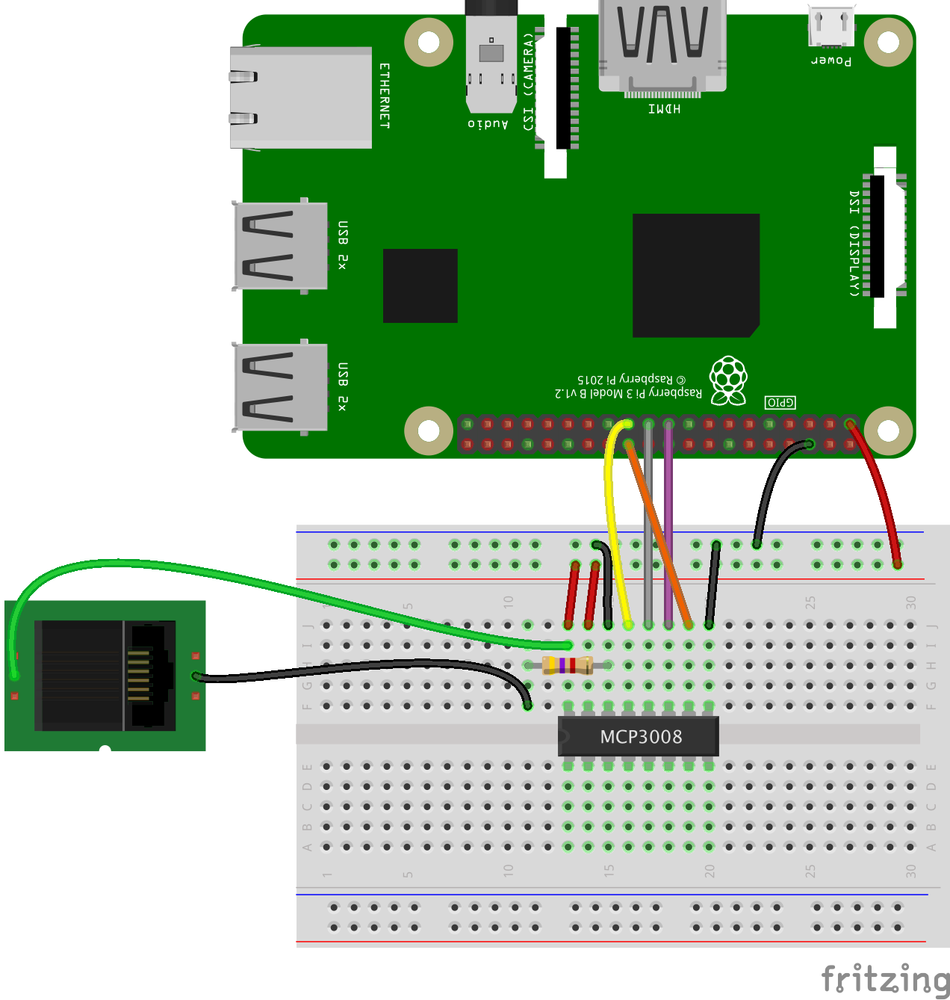

# Wind direction

A wind vane shows the direction from which the wind is coming, not where it's going; this can be confusing because TV weather maps show the opposite. It works by the wind exerting force on a vertical blade which rotates to find the position of least resistance; this position is then aligned with the direction of the oncoming wind.

The wind vane is more complex than the rain gauge or anemometer. It does use reed switches and magnets, but it works in a completely different way.

If you look inside the recommended wind vane, you'll see there are eight reed switches arranged like the spokes of a wheel.


There are also eight resistors in the wind vane, and as the magnet rotates, different reed switches will open and close and thus switch their corresponding resistor in and out of the circuit. Resistors are small components that resist/reduce the flow of electrical current but don't stop it; at the same time they also reduce the voltage moving through the circuit. Resistors can have different values; a low resistance value would let almost all voltage/current through, but a high resistance value would let very little through.

Each of the eight resistors have different values which you should see printed in white text next to them (e.g. you can see 8.2K on the right). This allows the wind vane to have 16 possible combinations of resistance, since the magnet is able to close two reed switches when halfway between them. More information can be found in the [datasheet](https://www.argentdata.com/files/80422_datasheet.pdf).

In order to read the wind direction from the vane, you'll need to be able to measure the resistance produced by the sensor and convert that into an angle value. There are several steps in this process.

### Measuring resistance.

Instead of measuring the resistance value directly, it is actually much easier to record a voltage from the wind vane which varies according to which combination of resistors is currently being switched into the circuit. This is an *analogue* signal because it continuously reports a **range** of voltages. Compare this to the anemometer which simply reported a `HIGH` or `LOW` voltage, all or nothing, which is a *digital* signal.

[[[generic-analogue-digital]]]

### Measuring analogue voltages with a Raspberry Pi

Unlike an Arduino which has analogue inputs, the Raspberry Pi only has digital inputs. So to be able to interpret an analogue signal, you need a special component called an Analogue to Digital Convertor (ADC).

A popular and versatile ADC is the MCP3008. It is a 16 pin Integrated Circuit (IC) that can easily be used with a breadboard and has 8 analogue inputs. It is a 10 bit ADC which means that is has 2^10 possible output values: so for a reference voltage of 5v, the smallest change in voltage that the MCP3008 can detect is 5/1024 = 4.88mV.

### Connecting the MCP3008


```Python
from gpiozero import MCP3008
adc = MCP3008(channel=0)
voltage = adc.value * 3.3
```

You may have noticed that the second page of the wind vane datasheet contains a circuit diagram and table that lists angle, resistance and voltage.

### Using a voltage divider

Voltage dividers are one of the most fundamental circuits in electronics and are used to reduce a large voltage into a smaller one.  


In the circuit above, Vout can be calculated using the formula:

Vout = Vin * R2/R1 +R2

So by varying the values of R1 and R2, you can reduce the input voltage Vin down to the output voltage Vout

Now if you imagine that R2 is actually some kind of variable resistor (a light dependent resistor for example), then by measuring Vout, we can calculate R2 as long as we know R1.

You may have noticed that the second page of the wind vane datasheet contains a voltage divider circuit diagram and table that lists angle, resistance and voltage. However, the logic levels on a Raspberry Pi are 3.3v so these figures will need adjusting.

- Using the list of resistances used in the wind vane, write a small Python program called `vane_values.py` to calculate the new values for a 3.3v Vin with a R1 resistor of 10K.


---hints---
---hint---
To start off, create a list that contains all the resistances:

```python
resistances = [33000, 6570, 8200, 891,
               1000, 688, 2200, 1410,
               3900, 3140, 16000, 14120,
               120000, 42120, 64900, 21880]
```
Then loop through this list, calculating the output voltage for each value.
---/hint---
---hint---

To loop through the list, printing each value out you could use the code:

```python
resistances = [33000, 6570, 8200, 891,
               1000, 688, 2200, 1410,
               3900, 3140, 16000, 14120,
               120000, 42120, 64900, 21880]
for x in range(len(resistances)):
    print(resistance[x])
```
This can be expanded to include the calculation too.
---/hint---
---hint---

A complete solution, including rounding the values to 3 decimal places is:
```python
resistances = [33000, 6570, 8200, 891,
               1000, 688, 2200, 1410,
               3900, 3140, 16000, 14120,
               120000, 42120, 64900, 21880]
for x in range(len(resistances)):
    print(resistances[x],round((3.3*resistances[x])/(resistances[x]+10000),3))
```
---/hint---
---/hints---

Using a value of R1 = 10K works well when the reference voltage is 5v, but you'll probably see that some of the possible voltages are quite close together. By using a smaller value for R1, you can optimise the separation between the different voltages that correspond to the resistance values produced by the vane.

Modify your `vane_values.py` code to test alternative values for R1. Remember that only certain standard resistance values are available. The most common in the range you'll need are: 1K, 1.2K, 1.5K, 1.8K, 2.2K. 2.7K, 3.3K, 4.7K, 5.6K, 6.8k, 8.2K.


- Now you know the value for R1 in the voltage divider circuit, you can wire everything up to your ADC and the Pi.



- Test that your circuit is able to discriminate between the various angular positions of the wind vane. Create a small python program called `vane_test.py` to record the different values produced by your circuit when the vane is rotated.  

---hints---
---hint---
Use the gpiozero library to create a MCP3008 instance:

```Python
from gpiozero import MCP3008
adc = MCP3008(channel=0)
```

---/hint---
---hint---

Then create a list to hold all the values:

```python
values = []
```
Then add a loop to repeatedly read voltage from the ADC and add the value to the list **if it isn't already present**.
---/hint---
---hint---

A complete solution is:
```Python
from gpiozero import MCP3008
adc = MCP3008(channel=0)
count = 0
values = []
while True:
    wind =round(adc.value*3.3,1)
    if not wind in values:
        values.append(wind)
        count+=1
        print(count)
```
---/hint---
---/hints---
