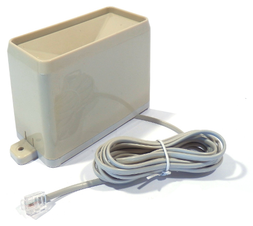
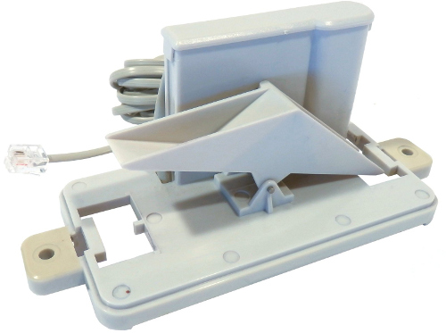
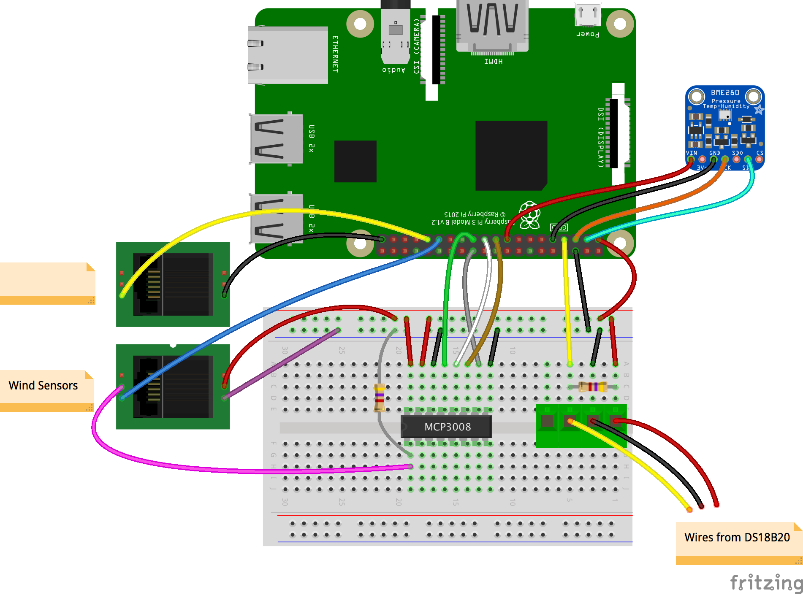

## Rainfall

Most rain gauges measure precipitation in millimeters in height collected on one square metre during a certain time period.

The recommended rain gauge sensor supplied with the Raspberry Pi Weather Station kit is actually a simple mechanical device.



## How does it work?

You can investigate the rain gauge and how it works by removing the bucket. Gently squeeze the clips on either side; the lid should then pop off.



This rain gauge is basically a self-emptying tipping bucket. Rain is collected and channelled into the bucket. Once enough rainwater has been collected, the bucket will tip over, the water will drain out from the base, and the opposite bucket will come up into position.

The product [data sheet](https://www.argentdata.com/files/80422_datasheet.pdf){:target="_blank"} tells us that 0.2794 mm of rain will tip the bucket. You can multiply this by the number of tips to calculate the amount of rainfall. If you're using a different type of rain gauge, then you should consult the relevant data sheet or determine the volume of water required experimentally.

Typically these gauges are fitted with an RJ11 plug even though they only use two wires: one red and one green. Inside the ridge between the two buckets, you should see a small cylindrical magnet that points towards the back wall. Inside the back wall there's a *reed switch*.

The top of the back wall does come off if you want to see inside; just pull on the flat end gently and it should release. Inside there's a small circuit board that you can remove to examine. In the middle of it you will see the reed switch. Replace the circuit board and back wall lid before continuing.

When one of the buckets tips, the magnet passes the reed switch, causing it to close momentarily. So, just like with the anemometer, if you connect the rain gauge to a GPIO pin on the Raspberry Pi, you can treat it like a button and count the number of 'presses' to calculate rainfall.

## Connecting your rain sensor

- To test the rain gauge, you'll need to either remove the RJ11 connector and strip the wires, or make use of an RJ11 breakout board.

The Oracle Weather Station rain gauge is connected to **GPIO pin 6** (BCM), so for consistency, use the same pin for your device.



- Using the code you wrote for the anemometer as a starting point, write a program called `/home/pi/weather-station/rainfall.py` to detect when the rain gauge bucket has tipped. It should print our a running count of how many bucket tips have occurred.

---hints---
---hint---
The `gpiozero` library provides an easy way to access button-like devices, and your bucket is connected to **GPIO 6**:

```python
from gpiozero import button
rain_sensor = Button(6)
```

---/hint---
---hint---
Create a function that is run whenever there's a bucket tip. You can assign a global variable as a counter to keep track of how many times the reed switch has been 'pressed'.
```python
def bucket_tipped():
    global count
    count = +=1
    print(count)
```
---/hint---
---hint---
Your program could look like this:

```python
from gpiozero import Button

rain_sensor = Button(6)
count = 0

def bucket_tipped():
    global count
    count = +=1
    print(count)

rain_sensor.when_pressed = bucket_tipped
```

---/hint---
---/hints---

Now that you can count bucket tips, you need to convert this into a height of water that equals the amount of rain that has fallen.  

- Modify your code to print the height of rain that has fallen each time the bucket tips.

---hints---
---hint---
You need to know how much rain causes your gauge's bucket to tip. In the case of the recommended sensor, this is 0.2794 mm. You could use a variable to store this value.

---/hint---
---hint---

Multiply the number of tips by the amount of rain necessary for a bucket tip.

---/hint---
---hint---
Your program could look like this.

```python
from gpiozero import Button

rain_sensor = Button(6)
BUCKET_SIZE = 0.2794
count = 0

def bucket_tipped():
    global count
    count = count + 1
    print (count * BUCKET_SIZE)


rain_sensor.when_pressed = bucket_tipped
```

---/hint---
---/hints---

- Finally, add a function `reset_rainfall` to reset the count of bucket tips so that it starts at `0` again. You will need this function for your fully operational weather station in the next step.

---hints---
---hint---
You can define a function called `reset_rainfall` with the following code:

```python
def reset_rainfall()
```

---/hint---
---hint---

Inside this function, you can set the `count` variable to `0`.

---/hint---
---hint---
Your program could look like this:

```python
from gpiozero import Button

rain_sensor = Button(6)
BUCKET_SIZE = 0.2794
count = 0

def bucket_tipped():
    global count
    count = count + 1
    print (count * BUCKET_SIZE)

def reset_rainfall():
    global count
    count = 0

rain_sensor.when_pressed = bucket_tipped
```

---/hint---
---/hints---
