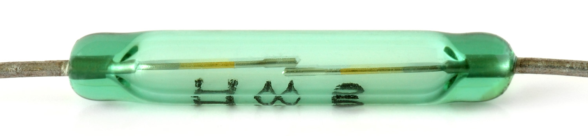

## Rainfall

The recommended rain gauge sensor supplied with the Raspberry Pi Weather Station kit is actually a simple mechanical device.


## How does it work?

You can investigate the rain gauge and how it works by removing the bucket. Gently squeeze the clips on either side; the lid should then pop off.


This rain gauge is basically a self-emptying tipping bucket. Rain is collected and channelled into the bucket. Once enough rainwater has been collected the bucket will tip over, the water will drain out from the base, and the opposite bucket will come up into position.

The product [datasheet](https://www.argentdata.com/files/80422_datasheet.pdf){:target="_blank"} tells us that 0.2794 mm of rain will tip the bucket. You can multiply this by the number of tips to calculate the amount of rainfall. If you're using a different type of rain gauge, then you should consult the relevant datasheet or determine the volume of water required experimentally.

Typically these gauges are fitted with an RJ11 plug even though they only use two wires: one red and one green.  Inside the ridge between the two buckets you should see a small cylindrical magnet that points towards the back wall. Inside the back wall there's a clever piece of electronics called a *reed switch*, pictured below.



The reed switch has two metal contacts inside it which will touch together when under the influence of a magnet. Therefore, electronically, this works in exactly the same way as a button connected to the Raspberry Pi. When the bucket tips, the magnet passes the reed switch, causing it to close momentarily. Because the switch is connected to GPIO pin 6 on the Raspberry Pi, this will generate a `LOW` signal on the pin which we can detect and record.

The top of the back wall does come off if you want to see inside; just pull on the flat end gently and it should release. Inside there's a small circuit board that you can remove to examine. In the middle of it you will see the reed switch. Replace the circuit board and back wall lid before continuing.


## Connecting your rain sensor

1. To test the rain gauge, you'll need to either remove the RJ11 connector and strip the wires or make use of am RJ11 breakout board.

When connected, the Weather Station rain gauge uses **GPIO pin 6** (BCM), so if you're using a rain gauge bought separately connect it to GPIO pin 6 for the code below to work.

## Sample code

The following program detects input from the rain gauge and converts it to a meaningful measurement which is displayed on screen:

  ```python
  from gpiozero import Button

  rain_sensor = Button(6)
  BUCKET_SIZE = 0.2794
  count = 0

  def bucket_tipped():
      global count
      count = count + 1
      print (count * BUCKET_SIZE)


  rain_sensor.when_pressed = bucket_tipped
```
